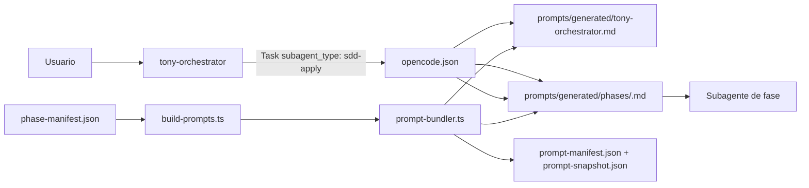

# Tony-AI - ARQUITECTURA
## Patrón de memoria: archivo "SQLite compartido"
El diseño central de Tony-AI es que **cada servicio de memoria tiene un servidor MCP (Python) y un plugin (Bun) que comparten el mismo archivo SQLite**:
```
┌─────────────────────────┐    ┌─────────────────────────┐
│  local-memory/server.py │    │   plugins/tonymem.ts    │
│  (MCP server, 8 tools)  │    │  (OpenCode hooks)       │
│                         │    │                         │
│  SQLite: memory.db      │◄──►│  bun:sqlite (WAL mode)  │
│  observations table     │    │  same file, same schema │
└─────────────────────────┘    └─────────────────────────┘

┌─────────────────────────┐    ┌─────────────────────────┐
│  judgment-memory/       │    │  plugins/judgment-      │
│  ledger.py + server.py  │    │  memory.ts + qdrant.ts  │
│  (MCP server, 4 tools)  │    │  (OpenCode hooks)       │
│                         │    │                         │
│  SQLite: judgment-      │◄──►│  bun:sqlite (WAL mode)  │
│  memory.db              │    │  same file, same schema │
│  judgments table        │    │                         │
│                         │    │  HTTP → Qdrant/Ollama   │
│  Qdrant: jdmem_{proj}   │◄──►│  (via plugins/qdrant.ts)│
└─────────────────────────┘    └─────────────────────────┘
```
Este patrón permite un acceso directo al archivo SQLite en modo **WAL**, que es el modo de concurrencia que SQLite está diseñado para soportar: **un escritor a la vez, lectores nunca bloquean**.

## Tres conceptos clave:
1. **Judgment Day no corre en paralelo con revisión 4R.**  
   Por defecto, después de la implementación corre la revisión 4R ordinaria (`review-risk/readability/reliability/resilience` + `review-refuter`). Judgment Day (dos jueces ciegos, `jd-judge-a`/`jd-judge-b`) solo se activa explícitamente — nunca ambos a la vez.

2. **TonyMem, Code Indexer/Qdrant y DCP trabajan en cada fase.**  
   Se consultan y escriben durante cada fase (contexto previo antes de arrancar, guardado de decisiones al terminar, poda de contexto continua). No hay una etapa "leer memoria" al final del pipeline.

3. **Judgment Day tiene memoria propia.**  
   Antes de lanzar a los jueces, se llama `jd_recall` (¿ya vimos un problema parecido?). Cuando la lineage llega a un estado terminal, el orquestador llama `jd_record`, que persiste en un ledger SQLite propio (`judgment-memory/ledger.py`) y lo embebe/indexa en Qdrant (colección `jdmem_{project}`, separada del Code Indexer). Ver `judgment-memory/README.md`.

## Componentes

### Kernel (Tony Kernel)
- **Orquestación determinista** — `kernel/orchestrator_integration.py` gobierna las 8 fases SDD (explore → archive) con checksums de fase, gate de artifacts, scope guard, retry budget y evidencias.
- **Plugin OpenCode** — `plugins/tony-kernel/index.ts` intercepta `tool.execute.before/after` para forzar `can_start_phase` antes de delegar y `record_phase_completion` después de ejecutar.
- **CLI** — `kernel/cli.py` expone `can_start_phase`, `record_delegation`, `record_phase_completion`, `check_scope`, `reset`, `status`.
- **Persistencia** — `kernel/persistence.py` guarda estado en `.tony-kernel/kernel-state.json` (WAL mode en SQLite). `task_ledger.py` trackea tareas por fase. `evidence_ledger.py` guarda evidencias.

### Servicios de contexto
- **TonyMem** — Memoria persistente para decisiones, hallazgos y compartición de contexto entre sesiones. Servidor MCP Python (`local-memory/server.py`) + plugin OpenCode (`plugins/tonymem.ts`) comparten el mismo `memory.db` en modo WAL. Lifecycle de memorias con 3 estados: `active` (default), `proven` (solución verificada, rankea primero en `mem_search`), `needs_review` (stale, no confiar sin verificar).
- **Code Indexer + Qdrant** — Búsqueda semántica sobre el código usando embeddings locales (`bge-m3`). Servidor MCP Python (`code-index/server.py`) con indexación incremental.
- **Poda de Contexto Dinámica (DCP)** — Gestión automática de la ventana de contexto (plugin externo en `.opencode/dcp.jsonc`).
- **Judgment Memory** — Puente entre Judgment Day y TonyMem. Persiste juicios en SQLite (`judgment-memory/ledger.py`) y los indexa en Qdrant (`jdmem_{project}`) para recall semántico.

### Protocolos compartidos
- **SDD Phase Common** (`skills/_shared/sdd-phase-common.md`) — Contrato de salida estructurado (Section D) que todas las fases SDD deben devolver: `status`, `executive_summary`, `artifacts`, `next_recommended`, `risks`, `skill_resolution`.
- **TonyMem Convention** (`skills/_shared/tonymem-convention.md`) — Topic keys, contratos de `mem_save`/`mem_get_observation`/`mem_search`/`mem_review`, aislamiento por proyecto, manejo de concurrencia, lifecycle de memorias (active/proven/needs_review).
- **OpenSpec Convention** (`skills/_shared/openspec-convention.md`) — Directorios, paths y delta spec sections para artifacts en filesystem.
- **Skill Resolver** (`skills/_shared/skill-resolver.md`) — Protocolo de resolución de skills desde el registry.

### Prompts de fases SDD
Cada fase tiene su propio prompt en `prompts/sdd/`:
`sdd-explore` → `sdd-propose` → `sdd-spec` → `sdd-design` → `sdd-tasks` → `sdd-apply` → `sdd-verify` → `sdd-archive`
Más `sdd-init` (bootstrap) y `sdd-onboard` (walkthrough guiado).
Cuando se activa explícitamente (por keywords como "juzgar" o "dual review"), ejecuta dos jueces de IA independientes:
- `jd-judge-a` (DeepSeek-R1 14B)
- `jd-judge-b` (Qwen3-Coder 30B) — deliberadamente distinto de `jd-judge-a` para verdadera corroboración

Antes de juzgar, `jd_recall` busca juicios similares anteriores. Después de completar, `jd_record` persiste el veredicto.

## Estructura del proyecto
```
tony-ai/
├── README.md                          # Introducción y quickstart
├── opencode.json                      # Config de agentes, MCP servers, permisos
├── AGENTS.md                          # Reglas de orquestación, idioma, memoria
├── ARCHITECTURE.md                    # Documentación técnica para entender el proyecto
├── INSTALL.md                         # Guía de instalación detallada
├── Makefile                           # Wrappers de tests, bootstrap, health, docker
├── requirements-dev.txt               # pytest (para correr tests/)
├── requirements-optional.txt          # tree-sitter (opt-in)
│
├── tests/                             # TODOS los tests del proyecto, centralizados
│   ├── test_kernel_state_machine.py   # Tests unitarios FSM + enforcement
│   ├── test_kernel_integration.py     # Tests de integración plugin ↔ Python
│   ├── test_kernel_cli.py             # Tests CLI (reset, record_delegation, etc.)
│   ├── test_kernel_hardening.py       # Tests de hardening (validaciones adversarias)
│   ├── test_kernel_enforcement.py     # Contrato de enforcement fail-closed
│   ├── test_sdd_flow_e2e.py           # Flujo aislado explore→archive, 28 checks adversariales
│   ├── test_tony_kernel_hooks.ts      # Unit tests del plugin (mocked client)
│   ├── test_tony_kernel_integration.ts# Puente TS → Python real (sin mocks)
│   ├── test_tony_kernel_e2e.ts        # End-to-end adversarial (flujo completo SDD + 7 ataques)
│   ├── test_local_memory_server.py    # Regression test (MCP framing, UPSERT, FTS)
│   ├── test_code_index_core.py        # Regression test (mock HTTP, incremental)
│   ├── test_judgment_memory_ledger.py # Regression test (mock Ollama/Qdrant)
│   └── test_judgment_memory_hooks.ts  # Test harness para hooks de plugin
│
├── kernel/                            # Tony Kernel — orquestación determinista SDD
│   ├── __init__.py
│   ├── cli.py                         # CLI: can_start_phase, record_phase_completion, check_scope, reset, status
│   ├── orchestrator_integration.py    # Phase controller + artifact gate + scope check + retry budget
│   ├── state_machine.py               # FSM de fases SDD
│   ├── phase_gate.py                  # Validación de transiciones de fase
│   ├── artifact_gate.py               # Validación de artifacts (exists + hash + validated + integral)
│   ├── artifact_store.py              # disk_artifact_store (sha256 + WAL)
│   ├── persistence.py                 # Persistencia WAL en .tony-kernel/kernel-state.json
│   ├── phase_checksum.py              # Detección de tampering post-completion
│   ├── retry_budget.py                # Presupuesto de reintentos por fase
│   ├── evidence_ledger.py             # Registro de evidencias por tarea
│   ├── task_ledger.py                 # Track de tareas por fase
│   ├── schemas.py                     # ArtifactRef, DelegationRecord, PhaseCompletion
│   └── mcp_server.py                  # MCP server para kernel (registrado en opencode.json)
│
├── config/
│   └── tony-memory.yaml               # Referencia documentada de env vars
│
├── docker/
│   ├── docker-compose.yml             # Ollama + Qdrant (backing services)
│   ├── docker-compose.gpu.yml         # Override opcional NVIDIA
│   ├── .env.example
│   └── README.md                      # Servicios de soporte en Linux
│
├── scripts/                           # Solo shell — bootstrap y operación
│   ├── setup.sh                       # Bootstrap idempotente
│   ├── health.sh                      # Verificación end-to-end
│   └── calibrate-ctx.sh               # Sincroniza num_ctx de Ollama con opencode.json/DCP
│
├── tools/
│   └── validate-config.ts             # Valida opencode.json, prompts, agents, MCP, skills
│
├── plugins/
│   ├── tonymem.ts                     # Hook OpenCode: auto-guardar sesiones + prompts
│   ├── qdrant.ts                      # Cliente REST Qdrant + Ollama (Bun)
│   ├── judgment-memory.ts             # Bridge: recall antes de JD, captura después
│   └── tony-kernel/                   # Tony Kernel plugin (deterministic SDD enforcement)
│       └── index.ts                   # Hook entry: before/after phase checks
│
├── prompts/
│   └── sdd/                           # Prompts de fases SDD (uno por fase)
│       ├── sdd-explore.md
│       ├── sdd-propose.md
│       ├── sdd-spec.md
│       ├── sdd-design.md
│       ├── sdd-tasks.md
│       ├── sdd-apply.md
│       ├── sdd-verify.md
│       ├── sdd-archive.md
│       ├── sdd-init.md
│       └── sdd-onboard.md
│
├── skills/
│   ├── _shared/                       # Protocolos comunes a todas las fases SDD
│   │   ├── SKILL.md
│   │   ├── sdd-phase-common.md        # Secciones A-E: skill loading, retrieval,
│   │   │                            # persistence, return envelope, review workload
│   │   ├── openspec-convention.md     # Directorios, paths, delta spec sections
│   │   ├── tonymem-convention.md      # Topic keys, mem_save/mem_search contracts
│   │   ├── sdd-status-contract.md     # Schema de structured status
│   │   ├── persistence-contract.md    # Contratos de persistencia por artifact store
│   │   ├── review-ledger-contract.md  # Contrato de review ledger para Judgment Day
│   │   └── skill-resolver.md          # Skill registry protocol
│   ├── sdd-explore/
│   ├── sdd-propose/
│   ├── sdd-spec/
│   ├── sdd-design/
│   ├── sdd-tasks/
│   ├── sdd-apply/
│   ├── sdd-verify/
│   ├── sdd-archive/
│   ├── sdd-init/
│   ├── sdd-onboard/
│   ├── judgment-day/
│   ├── chained-pr/
│   ├── branch-pr/
│   ├── work-unit-commits/
│   ├── comment-writer/
│   ├── issue-creation/
│   ├── go-testing/
│   ├── cognitive-doc-design/
│   └── skill-creator/
│
├── local-memory/                      # TonyMem — MCP server (8 tools)
│   ├── server.py
│   └── README.md
│
├── code-index/                        # Code Indexer + Qdrant — MCP server (3 tools)
│   ├── core.py                        # Chunking, embeddings, Qdrant client (stdlib)
│   ├── server.py
│   └── README.md
│
├── judgment-memory/                   # Judgment Day <-> TonyMem bridge
│   ├── ledger.py                      # SQLite ledger + normalize + embed + Qdrant
│   ├── server.py                      # jd_recall / jd_record / jd_history / jd_stats
│   ├── schema.json                    # Shape de un judgment record
│   ├── scripts/
│   │   └── verify-qdrant.ts           # Smoke test del cliente TS real
│   └── README.md
│
└── .opencode/
    └── dcp.jsonc                      # Config de DCP (plugin externo)
```

> Todos los tests viven en `tests/`, corridos con `pytest tests/` (Python) o `bun test tests/*.ts` (TypeScript) — ver [`## Comandos`](#comandos) y el `Makefile`.


## Comandos
| Comando | Descripción | Fuente | Offline |
|---------|-------------|--------|---------|
| `/sdd-init` | Inicializar contexto SDD | SQLite + config | ✅ |
| `/sdd-new <change>` | Nuevo cambio con SDD completo | Sub-agentes planning | ❌ |
| `/sdd-explore <task>` | Investigar una idea | Sub-agente explore | ❌ |
| `/sdd-propose` | Crear propuesta PRD | Sub-agente propose | ❌ |
| `/sdd-spec` | Especificación técnica | Sub-agente spec | ❌ |
| `/sdd-design` | Diseño técnico | Sub-agente design | ❌ |
| `/sdd-tasks` | Generar plan de tareas | Sub-agente tasks | ❌ |
| `/sdd-apply [change]` | Implementar tareas | Sub-agente writer | ❌ |
| `/sdd-verify [change]` | Validar implementación | Sub-agente verify | ❌ |
| `/sdd-archive [change]` | Cerrar cambio y archivar | SQLite/JSON | ✅ |
| `/sdd-onboard` | Walkthrough guiado de SDD | Sub-agente onboard | ❌ |
| `/sdd-status [change]` | Ver estado del cambio | Artifact store | ✅ |
| `/sdd-continue [change]` | Ejecutar siguiente fase | Sub-agentes | ❌ |
| `/sdd-ff <name>` | Fast-forward: propuesta → tareas | Sub-agentes planning | ❌ |
| `/memory-search "query"` | Búsqueda semántica en TonyMem + Judgment Memory | SQLite + Qdrant | ✅ / ❌ |
| `/memory-stats` | Estadísticas de memoria | SQLite | ✅ |
| `/judgment-history [project]` | Ver historial de juicios | SQLite ledger | ✅ |
| `juzgar esto` | Activar Judgment Day | 2 jueces + memoria | ❌ |
| `/kernel-status` | Estado del Kernel (fase actual, artifacts, checksums) | kernel-state.json | ✅ |
| `/kernel-reset` | Resetear estado del Kernel (solo desarrollo) | kernel-state.json | ✅ |

💡 Todo funciona offline excepto los comandos que requieren sub-agentes (`/sdd-new`, `/sdd-explore`, `/sdd-propose`, `/sdd-spec`, `/sdd-design`, `/sdd-tasks`, `/sdd-apply`, `/sdd-verify`, `/sdd-onboard`, `/sdd-continue`, `/sdd-ff`, `juzgar esto`) y búsqueda semántica (`/memory-search` con Qdrant/Ollama).

## Persistencia de Prompts
Hook chat.message → auto-guarda con type='prompt-capture'
Incluido en mem_context por defecto
Excluido de mem_search (bookkeeping)
Filtrar explícitamente: mem_search(query="...", type='prompt-capture')

## Variables de entorno

| Variable 						| Propósito 								| Valor por defecto 					| Usado por 							|
|-------------------------------|-------------------------------------------|---------------------------------------|---------------------------------------|
| `TONY_OLLAMA_URL` 			| Endpoint de Ollama 						| `http://localhost:11434` 				| Todos los servicios de embeddings 	|
| `TONY_QDRANT_URL` 			| Endpoint de Qdrant 						| `http://localhost:6333` 				| Code Indexer, Judgment Memory 		|
| `TONY_EMBED_MODEL` 			| Override del modelo de embeddings 		| `bge-m3` / `nomic-embed-text` 		| Por servicio de embeddings 			|
| `LOCAL_MEMORY_DB` 			| Archivo SQLite para TonyMem 				| `{cwd}/.tonymem/memory.db` 			| TonyMem 								|
| `JUDGMENT_MEMORY_DB` 			| Archivo SQLite para juicios 				| `{cwd}/.tonymem/judgment-memory.db` 	| Judgment Memory 						|
| `TONY_RECALL_SCORE_THRESHOLD` | Score mínimo para superficie de recall	| `0.5` 								| Filtrado de recall de Judgment Memory |

Por defecto, `code-index/` usa `bge-m3` para embeddings de código, mientras que `judgment-memory/` usa `nomic-embed-text` para tareas más cortas de recuperación en lenguaje natural.

## Modelos locales

| Rol | Modelo | Agentes |
|-----|--------|---------|
| Planificación | `ollama/qwen3-coder:30b` | `tony-orchestrator`, `sdd-explore`, `sdd-propose`, `sdd-design`, `sdd-spec`, `sdd-tasks`, `sdd-init`, `sdd-onboard` |
| Implementación | `ollama/omnicoder:9b` | `sdd-apply` |
| Revisión | `ollama/deepseek-r1:14b` | `sdd-verify`, `review-*` (5), `jd-judge-a` |
| Revisión (juez B) | `ollama/qwen3-coder:30b` | `jd-judge-b` — deliberadamente distinto de `jd-judge-a` |
| Ejecución | `ollama/ornith:9b` | `sdd-archive`, `jd-fix-agent` |


## Beneficios concretos:
1. Primera tarea: Configuras todo desde cero
2. Segunda tarea: Sistema te sugiere patrones similares
3. Tercera tarea: Ya tiene memoria de errores evitados
4. Tu sistema es progresivamente más útil con el uso. No es ML tradicional, es memoria semántica operacional.


## Principios de diseño
- **Local-first**: el almacenamiento es SQLite y está pensado para quedarse en tu máquina.
- **Dependency-light**: los servidores en Python usan solo stdlib, deliberadamente.
- **Separación de responsabilidades**:
  - `local-memory/` almacena observaciones de texto libre y estado de sesión.
  - `code-index/` busca código real semánticamente.
  - `judgment-memory/` almacena resultados normalizados de flujos de revisión completados.
- **Contratos explícitos**: cada fase SDD devuelve un envelope estructurado (Section D en `skills/_shared/sdd-phase-common.md`), con `status`, `executive_summary`, `artifacts`, `next_recommended`, `risks`, `skill_resolution`.
- **Indexado incremental**: el indexador de código saltea archivos sin cambios y limpia los borrados del índice.
- **Prompt separation**: los prompts de orquestación y fases viven en `prompts/sdd/` como archivos `.md` referenciados desde `opencode.json`, no inline en JSON.
- **Skill registry**: las skills se resuelven una vez por sesión desde el registry y se inyectan como rutas exactas en cada sub-agente, no se buscan ad-hoc.

## Integración de resolución programática por fase con OpenCode

### Idea central

La resolución programática ocurre durante el **build**, no dentro del modelo ni durante la ejecución de OpenCode. `phase-manifest.json` es la fuente de composición; `prompt-bundler.ts` resuelve sus includes y materializa archivos finales; `opencode.json` conecta cada nombre de agente con su bundle; finalmente, `tony-orchestrator` solo selecciona el `subagent_type` correcto.

> El orquestador decide **qué agente ejecutar**. OpenCode carga el prompt materializado definido para ese agente. El bundler decide **qué contenido recibe** ese agente.



## 1. Manifiesto: fuente de composición por fase

El archivo `prompts/agents/includes/phase-manifest.json` declara qué includes, skills y prompt específico corresponden a cada fase.

## 2. Resolver programáticamente el prompt de una fase

`tools/prompt-bundler.ts` expone `buildPhase(root, phase)`, que:

1. carga `phase-manifest.json`
2. expande includes base + específicos con deduplicación
3. expande skills compartidas desde `skills/_shared/`
4. concatena el prompt de fase específico (`prompts/sdd/<phase>.md` o `prompts/agents/phase-prompts/<phase>.md`)
5. valida que no queden tokens sin resolver
6. registra dependencias con SHA-256

El contrato de salida (`BuildResult`) incluye `path`, `content` y `dependencies[]`.

## 3. Materializar el orquestador y todas las fases

`tools/build-prompts.ts` genera el conjunto completo para evitar que el manifiesto, el snapshot y los bundles queden desalineados.

```bash
make build-prompts     # regenera bundles + manifest + snapshot
make check-prompts     # valida hashes y existencia
```

`check-prompts` compara el estado actual de disco contra lo que debería existir; si algún include cambió sin rebuild, falla.

## 4. Configuración de OpenCode

En `opencode.json`, cada agente de fase apunta a su bundle materializado:

```json
{
  "agent": {
    "tony-orchestrator": {
      "prompt": "{file:./prompts/generated/tony-orchestrator.md}"
    },
    "sdd-apply": {
      "prompt": "{file:./prompts/generated/phases/sdd-apply.md}"
    }
  }
}
```

OpenCode resuelve el campo `prompt` del agente seleccionado. Por eso la llamada `Task` no debe pegar el contenido completo del bundle en el contexto de la tarea.

## 5. Cómo debe delegar `tony-orchestrator`

El bundle raíz debe contener reglas como estas:

```md
## Dynamic Sub-Agent Launching

When launching a configured OpenCode sub-agent for phase `X`:

1. Use `subagent_type: "X"` in the `Task` call.
2. OpenCode loads `agent.X.prompt` from `opencode.json`.
3. Do not paste the complete materialized bundle into the task context.
4. Pass only the work request, artifacts, scope, and evidence contract.
5. Never ask the sub-agent to resolve includes or load phase-manifest.json.
```

Una delegación concreta desde el orquestador debería verse conceptualmente así:

```json
{
  "subagent_type": "sdd-apply",
  "description": "Implementar las tareas del cambio activo",
  "prompt": "Ejecutá las tareas aprobadas de la fase apply. Usá TDD si el contexto de sdd-init indica strict_tdd=true.",
  "artifacts": [
    {
      "kind": "tasks",
      "path": "sdd/cambio/tasks",
      "store": "tonymem",
      "hash": "..."
    }
  ],
  "allowedFiles": ["src/**", "tests/**"],
  "evidence": [],
  "phase": "apply"
}
```

El valor importante para OpenCode es `subagent_type: "sdd-apply"`. El valor `phase: "apply"` es metadata para el Kernel y la evidencia; no es el mecanismo que carga el prompt.

## 6. Flujo con el Kernel

Para las ocho fases SDD core, el plugin de Tony Kernel intercepta la delegación:

```ts
const args = input.arguments as Record<string, unknown>
const requestedPhase = derivePhase(args)

if (requestedPhase === null) return // agente de protocolo fuera del FSM

const result = await client.canStartPhase(requestedPhase)
if (!result.allowed) {
  throw new KernelBlockedError("Phase transition blocked")
}

await client.recordDelegation(requestedPhase, "sub-agent")
```

Después de la ejecución, el hook de completion valida artifacts, evidencia, scope y estado de la fase antes de registrar `recordPhaseCompletion`.

Los agentes `review-*`, `jd-*`, `sdd-init` y `sdd-onboard` deben estar explícitamente clasificados como agentes conocidos fuera del FSM. Un `subagent_type` desconocido sigue siendo bloqueado por `KernelBlockedError` (fail-closed).

## 7. Snapshot y drift

El build produce:

```text
prompts/generated/prompt-manifest.json
prompts/generated/prompt-snapshot.json
```

`prompt-manifest.json` registra SHA-256 por dependencia para detectar drift. `prompt-snapshot.json` registra el resultado final de cada bundle materializado:

```json
{
  "schema_version": 1,
  "generated_by": "tools/prompt-bundler.ts",
  "orchestrator": {
    "path": "prompts/generated/tony-orchestrator.md",
    "sha256": "...",
    "bytes": 32033,
    "lines": 416
  },
  "phases": {
    "sdd-apply": {
      "path": "prompts/generated/phases/sdd-apply.md",
      "sha256": "...",
      "bytes": 31843,
      "lines": 718
    }
  }
}
```

La validación debe fallar si cualquiera de estos artefactos está ausente o desactualizado:

```bash
make build-prompts
make check-prompts
make test-all
make coverage
```

En CI conviene ejecutar `make check-prompts` explícitamente antes de `make test-all`, y publicar el manifest y el snapshot como artifacts de la ejecución.

## 8. Reducción segura del prompt raíz

No conviene eliminar del root todo bloque grande indiscriminadamente. Debe permanecer el contexto que el orquestador necesita antes de delegar: routing, Kernel, permisos, estrategia de artifacts, contrato de resultados, deduplicación, skill resolution y handoff dinámico.

Los bloques específicos de executor o review deben vivir en el bundle de fase. Una reducción segura consiste en retirar includes duplicados y reemplazarlos por un handoff corto cuando la regla dependa de memoria o del estado de la sesión. Después de cada reducción se deben ejecutar `make check-prompts`, los tests del bundler y la suite completa.

## 9. Checklist final

```bash
bun run tools/build-prompts.ts
bun run tools/build-prompts.ts --check
bun test tests/prompt_bundler.test.ts
bun run tools/validate-config.ts
make test-all
make coverage
git diff --check
```

Si todo pasa, los cambios se pueden agregar y commitear:

```bash
git add .github/workflows/ci.yml Makefile TESTING.md prompts tests tools

git commit -m "feat: harden prompt graph, snapshot and phase resolution"
git push origin dev
```


## Principios de diseño
## Notas
- `AGENTS.md` define convenciones de orquestación, reglas de respuesta y patrones de uso de memoria/indexación esperados por el ecosistema de agentes circundante.
- `opencode.json` está presente en la raíz del repositorio, indicando que el repo está pensado para integrarse con una configuración de MCP/tooling compatible con OpenCode.
- El setup de Docker es solo para **Ollama** y **Qdrant**; los servidores MCP en Python están pensados para correr directamente sobre stdio en lugar de dentro de contenedores.
- Los prompts de fases SDD usan el patrón `{file:./prompts/sdd/<phase>.md}` para mantener `opencode.json` limpio y los prompts editables sin tocar JSON.
- `skills/_shared/` contiene los protocolos comunes que todas las fases SDD cargan: `sdd-phase-common.md` (secciones A-E), `tonymem-convention.md`, `openspec-convention.md`, `sdd-status-contract.md`, `persistence-contract.md`, `review-ledger-contract.md`, y `skill-resolver.md`.