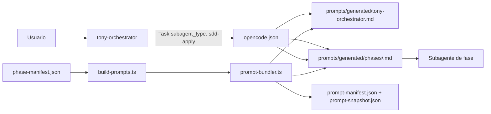

# Tony-AI - Instalación detallada

# 0. Requisitos
- **Python 3.10+** para los servidores MCP en Python.
- **Bun** para los scripts de verificación basados en TypeScript y plugins.
- **OpenCode CLI** (instalador oficial: https://opencode.ai)
- **Ollama** (https://ollama.com/download)
- **Docker** (opcional, para correr Qdrant + Ollama como servicios)
- **GGA** (opcional, para code review antes de commit — https://github.com/Gentleman-Programming/gentleman-guardian-angel)

## Para características semánticas (code-index y judgment-memory)
- **Qdrant** corriendo localmente o remotamente.
- La capa de memoria local funciona sin Ollama ni Qdrant. La búsqueda semántica de código y el recall de juicios requieren ambos servicios.

# 1. Clonar repositorio
```bash
git clone https://github.com/gastoncelestino/tony-ai.git
cd tony-ai
```

# 2. Instalación automática (recomendada)
```bash
./scripts/setup.sh    # Verifica dependencias, levanta servicios si hace falta, descarga modelos, configura .env
./scripts/health.sh   # Verificar estado del sistema
```

`setup.sh` hace:
1. Verifica dependencias (Python, Bun, OpenCode CLI, Docker)
2. Verifica Ollama + Qdrant: si ya responden no toca nada (modo nativo); si no responden y hay Docker, los levanta con `docker compose up -d`; si no hay Docker, pide que los levantes a mano
3. Descarga los modelos de Ollama (requiere Ollama respondiendo): qwen3-coder:30b, omnicoder:9b, deepseek-r1:14b, ornith:9b, bge-m3, nomic-embed-text
4. Instala `requirements-dev.txt` (pytest) y configura `.env.example`
5. Regenera `opencode.json` con rutas portables usando `TONY_REPO_ROOT`
6. Instala el pre-commit hook de prompt bundles (`.githooks/pre-commit`)

`health.sh` verifica:
1. OpenCode config válida
2. Los 4 MCP servers arrancan (TonyMem, Code Indexer, Judgment Memory, Tony Kernel)
3. Ollama responde y tiene los modelos
4. Qdrant responde
5. Pipeline de embeddings funcional

# 3. Instalación manual (si no hiciste la instalación automática)
## 3.1 Copiar configuración de OpenCode
```bash
mkdir -p ~/.opencode/plugins
cp opencode.json ~/.opencode/
cp AGENTS.md ~/.opencode/
cp plugins/tonymem.ts ~/.opencode/plugins/
cp plugins/qdrant.ts ~/.opencode/plugins/
cp plugins/judgment-memory.ts ~/.opencode/plugins/
cp plugins/tony-kernel/index.ts ~/.opencode/plugins/
```

## 3.2 Configurar variables de entorno
```bash
cp .env.example .env
```

Editá `.env` y ajustá `TONY_REPO_ROOT` a la ruta absoluta de tu clone:

```env
TONY_REPO_ROOT=/home/tu-usuario/proyectos/tony-ai
TONY_OLLAMA_URL=http://localhost:11434
TONY_QDRANT_URL=http://localhost:6333
JUDGMENT_EMBED_MODEL=nomic-embed-text
CODE_EMBED_MODEL=bge-m3
TONY_INDEX_CHUNKER=regex
```

Si usás Zsh:
```bash
echo 'export TONY_REPO_ROOT="'"$(pwd)"'"' >> ~/.zshrc
source ~/.zshrc
```

Si usás Bash:
```bash
echo 'export TONY_REPO_ROOT="'"$(pwd)"'"' >> ~/.bashrc
source ~/.bashrc
```

## Deberías ver algo como:
```bash
📄 .env
📄 AGENTS.md
📄 opencode.json
📁 plugins
   📄 tonymem.ts
   📄 qdrant.ts
   📄 judgment-memory.ts
   📄 tony-kernel/index.ts
```

## 3.3 Iniciar servicios de soporte
```bash
cd docker
docker compose up -d
docker compose ps
```

Deberías ver algo como:
| NAME | IMAGE | COMMAND | SERVICE | STATUS | PORTS |
|------|-------|---------|---------|--------|-------|
| tony-ai-qdrant | qdrant/qdrant:latest | /bin/qdrant... | qdrant | running | 0.0.0.0:6333->6333/tcp |
| tony-ai-ollama | ollama/ollama:latest | /usr/bin/ollama... | ollama | running | 0.0.0.0:11434->11434/tcp |

## 3.4 Descargar modelos de Ollama
## 3.4.1 Modelos grandes (descargan lentamente)
```bash
ollama pull qwen3-coder:30b
ollama pull deepseek-r1:14b
```
## 3.4.2 Modelos medianos
```bash
ollama pull omnicoder:9b
ollama pull ornith:9b
```
## 3.4.3 Modelos pequeños (rápidos)
```bash
ollama pull bge-m3
ollama pull nomic-embed-text
```

## 3.5 Instalar GGA (opcional — code review antes de commit)

GGA valida los archivos staged contra `AGENTS.md` en cada commit. Es una
herramienta externa que se instala una sola vez.

Necesitás 4 archivos del repo
[gentleman-guardian-angel](https://github.com/Gentleman-Programming/gentleman-guardian-angel):

```bash
# Crear directorios destino
mkdir -p ~/.local/bin
mkdir -p ~/.local/share/gga/lib

# Copiar los 4 archivos (cambiá la ruta al repo descargado)
cp ~/gentleman-guardian-angel/bin/gga            ~/.local/bin/gga
cp ~/gentleman-guardian-angel/lib/providers.sh  ~/.local/share/gga/lib/providers.sh
cp ~/gentleman-guardian-angel/lib/cache.sh      ~/.local/share/gga/lib/cache.sh
cp ~/gentleman-guardian-angel/lib/pr_mode.sh    ~/.local/share/gga/lib/pr_mode.sh

# Permisos de ejecución
chmod +x ~/.local/bin/gga ~/.local/share/gga/lib/*.sh

# Si venís de Windows (CRLF), convertir a LF:
dos2unix ~/.local/bin/gga ~/.local/share/gga/lib/providers.sh ~/.local/share/gga/lib/cache.sh ~/.local/share/gga/lib/pr_mode.sh

# Verificar
gga --version
```

Si `~/.local/bin` no está en tu PATH:
```bash
echo 'export PATH="$HOME/.local/bin:$PATH"' >> ~/.bashrc
source ~/.bashrc
```

# 4. Verificar instalación
```bash
make health          # Verificación end-to-end
make test            # Ejecutar todos los tests
```


# 5. Correr el suite de tests
## 5.1 Correr tests de Python + TypeScript. 
```bash
make test            # Tests completos (Python + TypeScript + Kernel)
make test-python     # Solo tests Python
make test-ts         # Solo tests TypeScript
make test-kernel     # Solo tests Kernel (state machine + integration + e2e adversarial)
make verify-qdrant   # Smoke test pipeline real
make health          # Verificar servicios
make clean           # Borrar bases SQLite locales
make docker-up       # Iniciar servicios Docker
make docker-down     # Detener servicios Docker
make validate-config # Validar opencode.json + prompts + skills
make build-prompts    # Regenerar bundles de prompts
make check-prompts    # Validar que los bundles estén actualizados
make generate-agents  # Sincronizar agents de opencode.json con phase-manifest.json
```

## 5.2 Comandos OpenCode (slash commands)
```bash
/sdd-init                      # Inicializar contexto SDD
/sdd-new <description>         # Nuevo change con planificación automática
/sdd-explore <task>            # Investigar una idea
/sdd-propose                   # Crear propuesta PRD
/sdd-spec                      # Especificación técnica detallada
/sdd-design                    # Diseño técnico y estructuras de datos
/sdd-tasks                     # Generar tareas de implementación
/sdd-apply                     # Implementar tareas pendientes
/sdd-verify                    # Validar implementación contra specs
/sdd-archive                   # Cerrar change y persistir estado final
/memory-search "query"         # Buscar decisiones anteriores
/memory-stats                  # Estadísticas de memoria por proyecto
/judgment-history              # Ver histórico de juicios
juzgar esto                    # Activar Judgment Day (revisión adversarial)
```

## 5.3 Integración de resolución programática por fase con OpenCode

### Idea central

La resolución programática ocurre durante el **build**, no dentro del modelo ni durante la ejecución de OpenCode. `phase-manifest.json` es la fuente de composición; `prompt-bundler.ts` resuelve sus includes y materializa archivos finales; `opencode.json` conecta cada nombre de agente con su bundle; finalmente, `tony-orchestrator` solo selecciona el `subagent_type` correcto.

> El orquestador decide **qué agente ejecutar**. OpenCode carga el prompt materializado definido para ese agente. El bundler decide **qué contenido recibe** ese agente.



## 1. Manifiesto: fuente de composición por fase

El archivo `prompts/agents/includes/phase-manifest.json` declara qué includes, skills y prompt específico corresponden a cada fase.

## 2. Resolver programáticamente el prompt de una fase

`tools/prompt-bundler.ts` expone `buildPhase(root, phase)`, que:

1. carga `phase-manifest.json`
2. expande includes base + específicos con deduplicación
3. expande skills compartidas desde `skills/_shared/`
4. concatena el prompt de fase específico (`prompts/sdd/<phase>.md` o `prompts/agents/phase-prompts/<phase>.md`)
5. valida que no queden tokens sin resolver
6. registra dependencias con SHA-256

El contrato de salida (`BuildResult`) incluye `path`, `content` y `dependencies[]`.

## 3. Materializar el orquestador y todas las fases

`tools/build-prompts.ts` genera el conjunto completo para evitar que el manifiesto, el snapshot y los bundles queden desalineados.

```bash
make build-prompts     # regenera bundles + manifest + snapshot
make check-prompts     # valida hashes y existencia
```

`check-prompts` compara el estado actual de disco contra lo que debería existir; si algún include cambió sin rebuild, falla.

## 4. Configuración de OpenCode

En `opencode.json`, cada agente de fase apunta a su bundle materializado:

```json
{
  "agent": {
    "tony-orchestrator": {
      "prompt": "{file:./prompts/generated/tony-orchestrator.md}"
    },
    "sdd-apply": {
      "prompt": "{file:./prompts/generated/phases/sdd-apply.md}"
    }
  }
}
```

OpenCode resuelve el campo `prompt` del agente seleccionado. Por eso la llamada `Task` no debe pegar el contenido completo del bundle en el contexto de la tarea.

## 5. Cómo debe delegar `tony-orchestrator`

El bundle raíz debe contener reglas como estas:

```md
## Dynamic Sub-Agent Launching

When launching a configured OpenCode sub-agent for phase `X`:

1. Use `subagent_type: "X"` in the `Task` call.
2. OpenCode loads `agent.X.prompt` from `opencode.json`.
3. Do not paste the complete materialized bundle into the task context.
4. Pass only the work request, artifacts, scope, and evidence contract.
5. Never ask the sub-agent to resolve includes or load phase-manifest.json.
```

Una delegación concreta desde el orquestador debería verse conceptualmente así:

```json
{
  "subagent_type": "sdd-apply",
  "description": "Implementar las tareas del cambio activo",
  "prompt": "Ejecutá las tareas aprobadas de la fase apply. Usá TDD si el contexto de sdd-init indica strict_tdd=true.",
  "artifacts": [
    {
      "kind": "tasks",
      "path": "sdd/cambio/tasks",
      "store": "tonymem",
      "hash": "..."
    }
  ],
  "allowedFiles": ["src/**", "tests/**"],
  "evidence": [],
  "phase": "apply"
}
```

El valor importante para OpenCode es `subagent_type: "sdd-apply"`. El valor `phase: "apply"` es metadata para el Kernel y la evidencia; no es el mecanismo que carga el prompt.

## 6. Flujo con el Kernel

Para las ocho fases SDD core, el plugin de Tony Kernel intercepta la delegación:

```ts
const args = input.arguments as Record<string, unknown>
const requestedPhase = derivePhase(args)

if (requestedPhase === null) return // agente de protocolo fuera del FSM

const result = await client.canStartPhase(requestedPhase)
if (!result.allowed) {
  throw new KernelBlockedError("Phase transition blocked")
}

await client.recordDelegation(requestedPhase, "sub-agent")
```

Después de la ejecución, el hook de completion valida artifacts, evidencia, scope y estado de la fase antes de registrar `recordPhaseCompletion`.

Los agentes `review-*`, `jd-*`, `sdd-init` y `sdd-onboard` deben estar explícitamente clasificados como agentes conocidos fuera del FSM. Un `subagent_type` desconocido sigue siendo bloqueado por `KernelBlockedError` (fail-closed).

## 7. Snapshot y drift

El build produce:

```text
prompts/generated/prompt-manifest.json
prompts/generated/prompt-snapshot.json
```

`prompt-manifest.json` registra SHA-256 por dependencia para detectar drift. `prompt-snapshot.json` registra el resultado final de cada bundle materializado:

```json
{
  "schema_version": 1,
  "generated_by": "tools/prompt-bundler.ts",
  "orchestrator": {
    "path": "prompts/generated/tony-orchestrator.md",
    "sha256": "...",
    "bytes": 32033,
    "lines": 416
  },
  "phases": {
    "sdd-apply": {
      "path": "prompts/generated/phases/sdd-apply.md",
      "sha256": "...",
      "bytes": 31843,
      "lines": 718
    }
  }
}
```

La validación debe fallar si cualquiera de estos artefactos está ausente o desactualizado:

```bash
make build-prompts
make check-prompts
make test-all
make coverage
```

En CI conviene ejecutar `make check-prompts` explícitamente antes de `make test-all`, y publicar el manifest y el snapshot como artifacts de la ejecución.

## 8. Reducción segura del prompt raíz

No conviene eliminar del root todo bloque grande indiscriminadamente. Debe permanecer el contexto que el orquestador necesita antes de delegar: routing, Kernel, permisos, estrategia de artifacts, contrato de resultados, deduplicación, skill resolution y handoff dinámico.

Los bloques específicos de executor o review deben vivir en el bundle de fase. Una reducción segura consiste en retirar includes duplicados y reemplazarlos por un handoff corto cuando la regla dependa de memoria o del estado de la sesión. Después de cada reducción se deben ejecutar `make check-prompts`, los tests del bundler y la suite completa.

## 9. Checklist final

```bash
bun run tools/build-prompts.ts
bun run tools/build-prompts.ts --check
bun test tests/prompt_bundler.test.ts
bun run tools/validate-config.ts
make test-all
make coverage
git diff --check
```

Si todo pasa, los cambios se pueden agregar y commitear:

```bash
git add .github/workflows/ci.yml Makefile TESTING.md prompts tests tools

git commit -m "feat: harden prompt graph, snapshot and phase resolution"
git push origin dev
```


## 5.4 Verificar el pipeline real de Qdrant/Ollama
## 5.4 Verificar el pipeline real de Qdrant/Ollama
```bash
opencode mcp list
```

## 5.5 Correr el indexador de código
```bash
cd code-index
python3 core.py index --path /ruta/al/repo --project mi-proyecto
python3 core.py search --query "manejo de reintentos HTTP" --project mi-proyecto
python3 core.py status --path /ruta/al/repo --project mi-proyecto
```

## 5.6 Correr tests de judgment-memory
```bash
python3 -m pytest tests/test_judgment_memory_ledger.py
```

## 5.7 Correr local-memory manualmente
```bash
cd local-memory
python3 server.py
```

| Componente 	| Test         | Qué cubre    |
|--------------|--------------|--------------|
| TonyMem server 					| `local-memory/server.py` (manual JSON-RPC) 	| Sesión completa: save, search, context, session-summary, prompt-capture, lifecycle (active/proven/needs_review + mark_stale/mark_reviewed/mark_proven + ranking) 		|
| TonyMem plugin 					| `plugins/tonymem.ts` (tipado `tsc`) 			| Tipado contra stubs de `bun:sqlite`/`@opencode-ai/plugin` 					|
| Code Indexer 						| `tests/test_code_index_core.py` 				| Chunking + mock HTTP end-to-end, 4/4 escenarios 								|
| DCP config 						| validado contra `dcp.schema.json` 			| Schema completo, `additionalProperties: false` 								|
| Judgment Day Memory Bridge 		| `tests/test_judgment_memory_ledger.py` 		| Mock Ollama+Qdrant, 7/7 escenarios incl. camino feliz 						|
| Judgment Day Memory Bridge 		| `tests/test_judgment_memory_hooks.ts` 		| Hooks de plugin (`chat.message`, `tool.execute.after`, `system.transform`) 	|
| Judgment Day Memory Bridge 		| `judgment-memory/scripts/verify-qdrant.ts` 	| Smoke test del cliente TS contra servicios reales 	|
| Tony Kernel 						| `tests/test_kernel_state_machine.py` 			| FSM phases, phase gate, artifact validation, scope guard, checksum drift 	|
| Tony Kernel 						| `tests/test_kernel_integration.py` 			| Integration tests: can_start_phase, record_phase_completion, evidence rejection 	|
| Tony Kernel 						| `tests/test_tony_kernel_e2e.ts` 				| End-to-end adversarial: phase skip, fake evidence, tampering, scope violation, unknown agent, failed task 	|
| Tony Kernel 						| `tests/test_sdd_flow_e2e.py` 					| Flujo aislado explore→archive contra el kernel real, 28 checks adversariales 	|


# 6. Troubleshooting

## OpenCode no encuentra los MCP servers
Verificá que `opencode.json` no tenga rutas absolutas:
```bash
grep -E '/home/[a-zA-Z0-9_]+/' opencode.json
```
Si encuentra algo, corré `make bootstrap` para regenerar las rutas con `{env:TONY_REPO_ROOT}`.

## Ollama no responde
```bash
curl http://localhost:11434/api/tags
```
Si no responde, iniciá el servicio:
```bash
ollama serve
```
O con Docker:
```bash
cd docker && docker compose up -d ollama
```

## Qdrant no responde
```bash
curl http://localhost:6333/readyz
```
Si no responde, iniciá el servicio:
```bash
cd docker && docker compose up -d qdrant
```

## Falla el smoke test de embeddings
Verificá que los modelos estén descargados:
```bash
ollama list | grep bge-m3
ollama list | grep nomic-embed-text
```
Si no están, descargalos:
```bash
ollama pull bge-m3
ollama pull nomic-embed-text
```

## Error: "module not found" en Python
Los servidores MCP usan solo stdlib — no requieren `pip install` ni dependencias externas.

Si te faltan módulos como `tree_sitter`, es porque activaste `TONY_INDEX_CHUNKER=tree-sitter`. Instalá las dependencias opcionales:
```bash
pip install -r requirements-optional.txt
```
O volver al chunker por defecto (regex, stdlib):
```bash
export TONY_INDEX_CHUNKER=regex
```

## Los comandos /sdd-* no aparecen en autocompletado
Reiniciá OpenCode CLI después de copiar `opencode.json` y `AGENTS.md` a `~/.opencode/`.