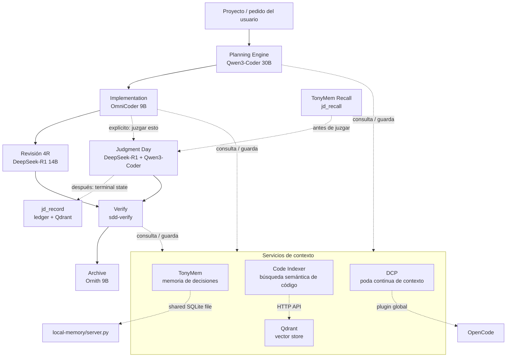

# Tony-AI
Tony-AI es un sistema de orquestación de agentes de IA para desarrollo de software que utiliza un flujo de trabajo de 
Desarrollo Guiado por Especificaciones (SDD) con múltiples LLMs locales. 
Herramientas locales de IA centradas en **memoria persistente**, **búsqueda semántica de código**, **historial de juicios** para un orquestador de estilo OpenCode/SDD. 
El repositorio combina tres subsistemas principales: `local-memory/` para memoria libre y duradera en SQLite,  `code-index/` para búsqueda semántica sobre código fuente usando Ollama + Qdrant, y `judgment-memory/` para almacenar y recuperar resultados previos de revisiones/juicios. 
Los assets de Docker en `docker/` proporcionan los servicios de soporte locales de Ollama y Qdrant utilizados por los componentes semánticos.


## ¿Cómo funciona?
El orquestador trabaja por fases. Primero explora/propuesta/spec/diseño/tareas, después implementa, luego verifica y finalmente archiva.   

TonyMem guarda decisiones y contexto entre sesiones, code-index te deja buscar "por significado" dentro del repo, y judgment-memory recuerda revisiones anteriores parecidas para no arrancar siempre desde cero.  

A nivel técnico, el stack pide Python 3.10+, Bun, Ollama, Qdrant y opcionalmente Docker para levantar los servicios auxiliares.  
Los modelos por defecto son: qwen3-coder:30b, omnicoder:9b, deepseek-r1:14b, ornith:9b, y embeddings con bge-m3 y nomic-embed-text. 


## ¿Qué es SDD?
Spec-Driven Development es un enfoque estructurado para construir cambios en software a través de ocho fases:

1. **Explorar** — Investigar ideas, leer código, comparar enfoques
2. **Proponer** — Crear una propuesta de cambio con contexto de negocio
3. **Especificación** — Escribir especificación técnica detallada
4. **Diseño** — Definir arquitectura técnica y estructuras de datos
5. **Tareas** — Desglosar specs en tareas implementables
6. **Aplicar** — Implementar el cambio
7. **Verificar** — Validar implementación contra specs
8. **Archivar** — Cerrar el cambio con estado final


## Qué incluye este repositorio
- **TonyMem (`local-memory/`)**: un servidor MCP en Python con solo stdlib que proporciona memoria local persistente en SQLite, incluyendo herramientas para guardar, buscar, actualizar, resumen de sesión y recuperación contextual.
- **Code Indexer (`code-index/`)**: búsqueda semántica sobre un codebase, usando llamadas HTTP a Ollama para embeddings y Qdrant para almacenamiento vectorial.
- **Judgment Memory (`judgment-memory/`)**: un puente que almacena la salida final de flujos de revisión/juicio para que tareas futuras similares puedan recuperar resultados previos en lugar de empezar desde cero.
- **Servicios de Docker (`docker/`)**: archivos Compose y documentación para correr Ollama y Qdrant localmente.
- **Assets de agentes (`commands/`, `prompts/`, `skills/`, `plugins/`)**: definiciones de comandos, prompts SDD, skills e integraciones de plugins usadas por la capa de orquestación.


## Arquitectura [ARCHITECTURE.md](https://github.com/gastoncelestino/tony-ai/blob/main/ARCHITECTURE.md)
```text
                         ┌──────────────────────┐
                         │     OpenCode / SDD   │
                         │     Orquestador      │
                         └──────────┬───────────┘
                                    │
                 ┌──────────────────┼──────────────────┐
                 │                  │                  │
                 ▼                  ▼                  ▼
        ┌───────────────┐   ┌───────────────┐  ┌─────────────────┐
        │ local-memory  │   │  code-index   │  │ judgment-memory │
        │ memoria SQLite│   │ RAG semántico │  │ recuperación de │
        │               │   │               │  │ juicios         │
        └──────┬────────┘   └──────┬────────┘  └────────┬────────┘
               │                   │                    │
               ▼                   ▼                    ▼
         Base de datos      Ollama + Qdrant       SQLite + Qdrant
         SQLite              para embeddings       para juicios
```

## Cómo funciona?


## Requisitos
1. Python 3.10+
2. Bun
3. OpenCode CLI (https://opencode.ai)
4. Ollama (https://ollama.com/download)
5. Docker (opcional, para Qdrant + Ollama como servicios)   


## Clonar repositorio
> **Nota:** el repo es privado. Necesitás acceso concedido por el owner; sin ese permiso `git clone` fallará con un error de autenticación.

```bash
git clone https://github.com/gastoncelestino/tony-ai.git
cd tony-ai
```

# 1. Instalación automática (recomendada) [INSTALL.md](https://github.com/gastoncelestino/tony-ai/blob/main/INSTALL.md)
```bash
make docker-up     # Opcional: levanta Ollama + Qdrant en Docker (o `ollama serve` si lo tenés nativo)
./scripts/setup.sh    # Verifica dependencias, descarga TODOS los modelos, configura .env
./scripts/health.sh   # Verifica estado del sistema
```

`setup.sh` hace:
1. Verifica dependencias (Python, Bun, OpenCode CLI, Docker)
2. Verifica que Ollama y Qdrant ya estén corriendo (no los levanta — usá `make docker-up` o `ollama serve` antes)
3. Descarga los modelos de Ollama (requiere Ollama respondiendo): qwen3-coder:30b, omnicoder:9b, deepseek-r1:14b, ornith:9b, bge-m3, nomic-embed-text
4. Configura `.env.example`
5. Regenera `opencode.json` con rutas portables

`health.sh` verifica:
1. OpenCode config válida
2. Los 3 MCP servers arrancan
3. Ollama responde y tiene los modelos
4. Qdrant responde
5. Pipeline de embeddings funcional


## Comandos Principales

## Comandos OpenCode (slash commands)
```bash
/sdd-init                      # Inicializar contexto SDD
/sdd-new <description>         # Nuevo change con planificación automática
/sdd-explore <task>            # Investigar una idea
/sdd-propose                   # Crear propuesta PRD
/sdd-spec                      # Especificación técnica detallada
/sdd-design                    # Diseño técnico y estructuras de datos
/sdd-tasks                     # Generar tareas de implementación
/sdd-apply                     # Implementar tareas pendientes
/sdd-verify                    # Validar implementación contra specs
/sdd-archive                   # Cerrar change y persistir estado final
/memory-search "query"         # Buscar decisiones anteriores
/memory-stats                  # Estadísticas de memoria por proyecto
/judgment-history              # Ver histórico de juicios
juzgar esto                    # Activar Judgment Day (revisión adversarial)
```

## Comandos de desarrollo (terminal)
```bash
make test            # Tests completos (Python + TypeScript)
make test-python     # Solo tests Python
make test-ts         # Solo tests TypeScript
make verify-qdrant   # Smoke test pipeline real
make health          # Verificar servicios
make clean           # Borrar bases SQLite locales
make docker-up       # Iniciar servicios Docker
make docker-down     # Detener servicios Docker
```

## Agradecimientos
Toda la definición de SDD, orchestator, prompts, skills y commands, se basan en el repositorio de github `gentle-ai` de Alan Buscaglia `The Gentleman`, especial agradecimiento por todo el contenido que comparte y su esfuerzo para ayudar a la comunidad.
Se trató de reutilizar el código que ya está probado y funciona correctamente, se agregaron componentes como `Code Indexer` (RAG semántico), `TonyMem` (base de datos SQLite), `Judgment Day` (SQLite, Qdrant para juicios y Ollama con modelos locales).

La intención es descargar este repositorio en la carpeta global .opencode/ → correr un único instalador /scripts/setup.sh y correr health.sh para verificar la instalación → tener mas control de los archivos para una contínua mejora.  

Se trató de documentar lo más posible, por si querés modificar algo de tu interés.

Muchas gracias
