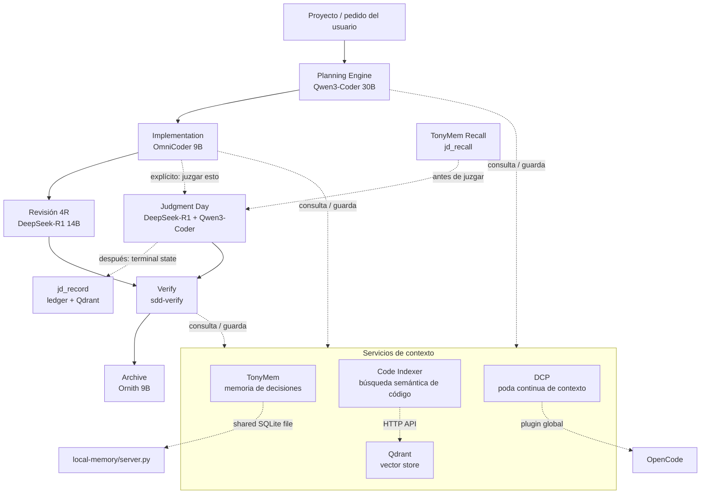
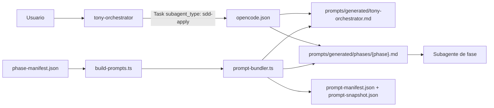

# Tony-AI
Tony-AI es un sistema de orquestación de agentes de IA para desarrollo de software que utiliza un flujo de trabajo de 
Desarrollo Guiado por Especificaciones (SDD) con múltiples LLMs locales. 
Herramientas locales de IA centradas en **memoria persistente**, **búsqueda semántica de código**, **historial de juicios** para un orquestador de estilo OpenCode/SDD. 
El repositorio combina tres subsistemas principales: `local-memory/` para memoria libre y duradera en SQLite,  `code-index/` para búsqueda semántica sobre código fuente usando Ollama + Qdrant, y `judgment-memory/` para almacenar y recuperar resultados previos de revisiones/juicios. 
Los assets de Docker en `docker/` proporcionan los servicios de soporte locales de Ollama y Qdrant utilizados por los componentes semánticos.


## ¿Cómo funciona?
El orquestador trabaja por fases. Primero explora/propuesta/spec/diseño/tareas, después implementa, luego verifica y finalmente archiva.   
El Tony Kernel intercepta cada transición de fase: valida artifacts, verifica checksums, aplica scope guard y evidencia antes de permitir el avance. Si algo falla, bloquea la fase y reporta el error exacto.

TonyMem guarda decisiones y contexto entre sesiones, code-index te deja buscar "por significado" dentro del repo, y judgment-memory recuerda revisiones anteriores parecidas para no arrancar siempre desde cero.  

A nivel técnico, el stack pide Python 3.10+, Bun, Ollama, Qdrant y opcionalmente Docker para levantar los servicios auxiliares.  
Los modelos por defecto son: qwen3-coder:30b, omnicoder:9b, deepseek-r1:14b, ornith:9b, y embeddings con bge-m3 y nomic-embed-text. 



## ¿Qué es SDD?
Spec-Driven Development es un enfoque estructurado para construir cambios en software a través de ocho fases:

1. **Explorar** — Investigar ideas, leer código, comparar enfoques
2. **Proponer** — Crear una propuesta de cambio con contexto de negocio
3. **Especificación** — Escribir especificación técnica detallada
4. **Diseño** — Definir arquitectura técnica y estructuras de datos
5. **Tareas** — Desglosar specs en tareas implementables
6. **Aplicar** — Implementar el cambio
7. **Verificar** — Validar implementación contra specs
8. **Archivar** — Cerrar el cambio con estado final


## Qué incluye este repositorio
- **Tony Kernel (`kernel/` + `plugins/tony-kernel/`)**: orquestación determinista de las 8 fases SDD. Intercepta transiciones de fase, valida artifacts con hash sha256, detecta tampering post-completion, aplica scope guard sobre diffs, registra evidencias y retry budgets. Incluye suite adversarial e2e (9 tests).
- **TonyMem (`local-memory/`)**: un servidor MCP en Python con solo stdlib que proporciona memoria local persistente en SQLite, incluyendo herramientas para guardar, buscar, actualizar, resumen de sesión y recuperación contextual.
- **Code Indexer (`code-index/`)**: búsqueda semántica sobre un codebase, usando llamadas HTTP a Ollama para embeddings y Qdrant para almacenamiento vectorial.
- **Judgment Memory (`judgment-memory/`)**: un puente que almacena la salida final de flujos de revisión/juicio para que tareas futuras similares puedan recuperar resultados previos en lugar de empezar desde cero.
- **Servicios de Docker (`docker/`)**: archivos Compose y documentación para correr Ollama y Qdrant localmente.
- **Assets de agentes (`commands/`, `prompts/`, `skills/`, `plugins/`)**: definiciones de comandos, prompts SDD, skills e integraciones de plugins usadas por la capa de orquestación.


## Arquitectura [ARCHITECTURE.md](https://github.com/gastoncelestino/tony-ai/blob/main/ARCHITECTURE.md)
```text
                         ┌──────────────────────┐
                         │     OpenCode / SDD   │
                         │     Orquestador      │
                         └──────────┬───────────┘
                                    │
                         ┌──────────▼───────────┐
                         │    Tony Kernel       │
                         │  Phase Gate + Scope  │
                         │  Guard + Artifacts   │
                         └──────────┬───────────┘
                                    │
                  ┌─────────────────┼─────────────────┐
                  │                 │                 │
                  ▼                 ▼                 ▼
         ┌───────────────┐   ┌───────────────┐  ┌─────────────────┐
         │ local-memory  │   │  code-index   │  │ judgment-memory │
         │ memoria SQLite│   │ RAG semántico │  │ recuperación de │
         │               │   │               │  │ juicios         │
         └──────┬────────┘   └──────┬────────┘  └────────┬────────┘
                │                   │                    │
                ▼                   ▼                    ▼
          Base de datos      Ollama + Qdrant       SQLite + Qdrant
          SQLite              para embeddings       para juicios
```

## Idea central
La resolución programática ocurre durante el **build**, no dentro del modelo ni durante la ejecución de OpenCode. `phase-manifest.json` es la fuente de composición; `prompt-bundler.ts` resuelve sus includes y materializa archivos finales; `opencode.json` conecta cada nombre de agente con su bundle; finalmente, `tony-orchestrator` solo selecciona el `subagent_type` correcto.

>El orquestador decide **qué agente ejecutar**. OpenCode carga el prompt materializado definido para ese agente. El bundler decide **qué contenido recibe** ese agente.



# Requisitos
- **Python 3.10+** para los servidores MCP en Python.
- **Bun** para los scripts de verificación basados en TypeScript y plugins.
- **OpenCode CLI** (instalador oficial: https://opencode.ai)
- **Ollama** (https://ollama.com/download)
- **Docker** (opcional, para correr Qdrant + Ollama como servicios)
- **GGA** (opcional, para code review antes de commit — https://github.com/Gentleman-Programming/gentleman-guardian-angel)


# Clonar repositorio
```bash
git clone https://github.com/gastoncelestino/tony-ai.git
cd tony-ai
```

# Instalación automática (recomendada) [INSTALL.md](https://github.com/gastoncelestino/tony-ai/blob/main/INSTALL.md)
```bash
./scripts/setup.sh    # Verifica dependencias, levanta servicios si hace falta, descarga modelos, configura .env.example
./scripts/health.sh   # Verifica estado del sistema
```


# Como empezar con Tony-AI

```bash
# 1. Inicializá el proyecto (una sola vez)
/sdd-init

# 2. Creá un cambio nuevo
/sdd-new "agregar rate limiting al endpoint de login"
```

El orquestador hace el trabajo pesado: explora el código, arma una propuesta, genera la spec, el diseño y las tareas. Podés intervenir en cualquier momento:

```bash
/sdd-explore "chequear si hay middleware de auth existente"
/sdd-propose   # ajustar la propuesta si hace falta
/sdd-design    # modificar el diseño antes de implementar
```

```bash
# 3. Implementá y validá
/sdd-apply                    # implementá las tareas
/sdd-verify                   # validá contra las specs
/sdd-archive                  # cerrá el cambio
```

Si algo falla, el Kernel te dice exactamente por qué:

- **Artifacts faltantes o con hash inválido** → volvé a generar el artifact de la fase actual
- **Diff fuera de allowed_files** → revisá el scope en `openspec/change-request.md`
- **Salto de fase** → completá la fase anterior antes de avanzar

```bash
# 4. Consultá memoria en cualquier momento
/memory-search "rate limiting"
/memory-stats
/judgment-history
/kernel-status                # estado actual del Kernel (fase, artifacts, checksums)
```

### Iterar sobre un cambio existente

```bash
/sdd-load <change-id>          # retomá un cambio anterior
/sdd-apply                     # seguí con las tareas pendientes
/sdd-verify                    # re-validá si tocaste specs
/sdd-archive                   # cerrá la nueva iteración
```

### Activar Judgment Day

Para revisiones adversariales explícitas:

```bash
juzgar esto
```

El sistema busca juicios previos similares en memoria, ejecuta 2 jueces en paralelo y registra el resultado para futuras referencias.


### mem_save_prompt

- Llamado por el hook `chat.message` en `tonymem.ts`
- Captura prompts crudos con `type='prompt-capture'`
- Excluido de búsquedas por defecto (bookkeeping)
- Se puede filtrar explícitamente si necesitás revisar prompts

Estas entradas se usan para `mem_context` (recuperar el contexto de la sesión actual) pero **se excluyen por defecto de `mem_search`** — no son decisiones ni descubrimientos, son bookkeeping interno. Si necesitás buscar prompts, filtrá explícitamente por `type='prompt-capture'`.


## TonyMem - Memoria Persistente
```bash
# Cada decisión/descubrimiento se guarda en SQLite
mem_save(task="manejo retry HTTP", observation="usar exponential backoff")

# Luego se recupera en nuevas conversaciones
mem_search("retry HTTP") → encuentra la decisión guardada
```
Aprende de: Decisiones arquitectónicas, bugs resueltos, patrones de código

## Judgment Memory - Lecciones de Revisiones
```bash
# Después de cada Judgment Day:
jd_record(task="validar JWT", final="approve", lesson="siempre verificar signature expiration")
# Futuras tareas similares recuerdan esta lección
```
Aprende de: Errores de review, mejores prácticas validadas

## Code Indexer - Conocimiento del Codebase
- Indexa incrementalmente (solo cambios)
- Embeddings semánticos con bge-m3
- Búsquedas como "cómo se maneja la autenticación" te encuentran código relevante

Aprende de: Crecimiento del codebase, patrones emergentes

## Hooks de OpenCode (tonymem.ts)
```bash
// Hook que captura automáticamente lo que haces
"chat.message" → mem_save_prompt() // guarda prompts
"task.execute.after" → guarda discoveries importantes
```

## Cómo funciona el aprendizaje en práctica:
```bash
Usuario: "Implementa login con refresh token"
```

1. `/sdd-new` → delega `sdd-explore` + `sdd-propose` a sub-agentes
2. `mem_search()` → encuentra decisión previa sobre JWT
3. `code_search()` → encuentra cómo funciona auth actual
4. `jd_recall()` → recuerda lección sobre token expiration
5. `/sdd-tasks` → genera plan de implementación
6. `/sdd-apply` → implementa las tareas
7. `/sdd-verify` → valida contra specs
8. `/sdd-archive` → cierra el cambio, guarda `archive-report`
9. `juzgar esto` → dos jueces review + lesson guardada en `jd_record`

## Code Review automático
`GGA` valida los archivos staged contra tu `AGENTS.md` antes de cada commit, usando OpenCode como proveedor de IA.
El repo ya incluye `.gga` (config) y el agente `gga-reviewer` en `opencode.json`. Solo falta instalar el hook:

```bash
gga install          # crea .git/hooks/pre-commit (local, no se commitea)
gga config           # verificar configuración
gga run              # revisar archivos staged
gga run --pr-mode    # revisar todos los cambios del PR vs main
gga run --no-cache   # ignorar cache y revisar todo
```

## Agradecimientos
Algunos conceptos de SDD, orquestador, prompts, skills y comandos se basan en el repositorio `gentle-ai` de Alan Buscaglia (`The Gentleman`), a quien agradecemos por su contenido y aportes a la comunidad.

Se incorporaron subsistemas propios como `Code Indexer` (RAG semántico), `TonyMem` (memoria en SQLite WAL), `Judgment Memory` (ledger y recall de juicios con Ollama y Qdrant) y `Tony Kernel` (orquestación determinista de fases SDD con gates de artefactos, scope guard y detección de tampering).