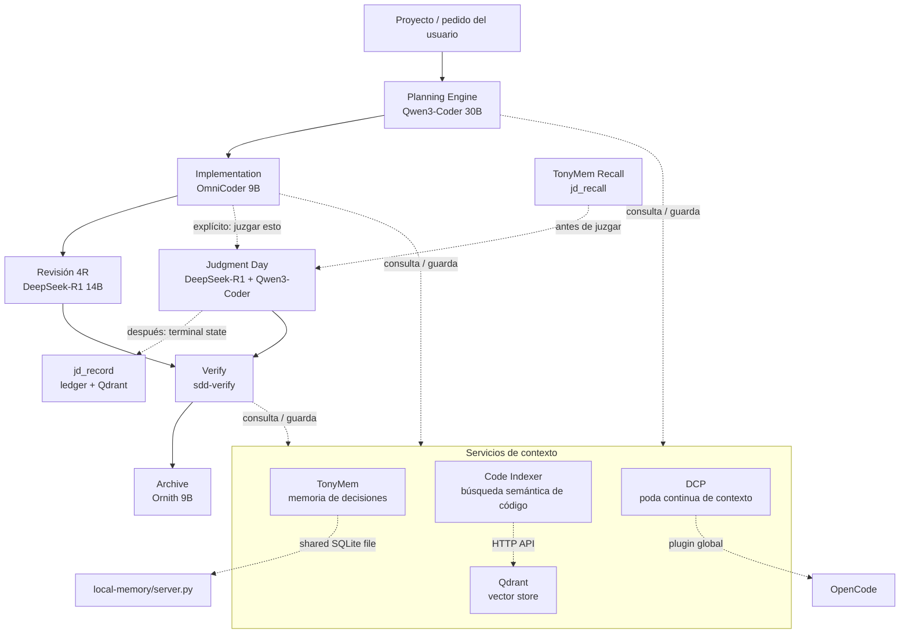

# Tony-AI
Tony-AI es un sistema de orquestación de agentes de IA para desarrollo de software que utiliza un flujo de trabajo de Desarrollo Guiado por Especificaciones (SDD) con múltiples LLMs locales.
Herramientas locales de IA centradas en **memoria persistente**, **búsqueda semántica de código**, **historial de juicios** para un orquestador de estilo OpenCode/SDD.
El repositorio combina tres subsistemas principales: `local-memory/` para memoria libre y duradera en SQLite, `code-index/` para búsqueda semántica sobre código fuente usando Ollama + Qdrant, y `judgment-memory/` para almacenar y recuperar resultados previos de revisiones/juicios.
Los assets de Docker en `docker/` proporcionan los servicios de soporte locales de Ollama y Qdrant utilizados por los componentes semánticos.

## ¿Cómo funciona?
El orquestador trabaja por fases. Primero explora/propuesta/spec/diseño/tareas, después implementa, luego verifica y finalmente archiva. El Tony Kernel intercepta cada transición de fase: valida artifacts, verifica checksums, aplica scope guard y evidencia antes de permitir el avance. Si algo falla, bloquea la fase y reporta el error exacto.

TonyMem guarda decisiones y contexto entre sesiones, code-index te deja buscar "por significado" dentro del repo, y judgment-memory recuerda revisiones anteriores parecidas para no arrancar siempre desde cero.

A nivel técnico, el stack pide Python 3.10+, Bun, Ollama, Qdrant y opcionalmente Docker para levantar los servicios auxiliares.
Los modelos por defecto son: qwen3-coder:30b, **carstenuhlig/omnicoder-9b**, deepseek-r1:14b, ornith:9b, y embeddings con bge-m3 y nomic-embed-text.



## ¿Qué es SDD?
Spec-Driven Development es un enfoque estructurado para construir cambios en software a través de ocho fases:

1. **Explorar** — Investigar ideas, leer código, comparar enfoques
2. **Proponer** — Crear una propuesta de cambio con contexto de negocio
3. **Especificación** — Escribir especificación técnica detallada
4. **Diseño** — Definir arquitectura técnica y estructuras de datos
5. **Tareas** — Desglosar specs en tareas implementables
6. **Aplicar** — Implementar el cambio
7. **Verificar** — Validar implementación contra specs
8. **Archivar** — Cerrar el cambio con estado final

## Qué incluye este repositorio
- **Tony Kernel (`kernel/` + `plugins/tony-kernel/`)**: orquestación determinista de las 8 fases SDD. Intercepta transiciones de fase, valida artifacts con hash sha256, detecta tampering post-completion, aplica scope guard sobre diffs, registra evidencias y retry budgets. Incluye suite adversarial e2e.
- **TonyMem (`local-memory/`)**: un servidor MCP en Python con solo stdlib que proporciona memoria local persistente en SQLite.
- **Code Indexer (`code-index/`)**: búsqueda semántica sobre un codebase, usando llamadas HTTP a Ollama para embeddings y Qdrant para almacenamiento vectorial.
- **Judgment Memory (`judgment-memory/`)**: un puente que almacena la salida final de flujos de revisión/juicio para que tareas futuras similares puedan recuperar resultados previos.
- **Servicios de Docker (`docker/`)**: archivos Compose y documentación para correr Ollama y Qdrant localmente.
- **Assets de agentes (`commands/`, `prompts/`, `skills/`, `plugins/`)**: definiciones de comandos, prompts SDD, skills e integraciones de plugins usadas por la capa de orquestación.

## Requisitos
- **Python 3.10+** para los servidores MCP en Python.
- **Bun** para los scripts de verificación basados en TypeScript y plugins.
- **OpenCode CLI** (instalador oficial: https://opencode.ai)
- **Ollama** (https://ollama.com/download)
- **Docker** (opcional, para correr Qdrant + Ollama como servicios)
- **GGA** (opcional, para code review antes de commit — https://github.com/Gentleman-Programming/gentleman-guardian-angel)

# Clonar repositorio
```bash
git clone https://github.com/gastoncelestino/tony-ai.git
cd tony-ai
```

# Instalación automática (recomendada) [INSTALL.md](https://github.com/gastoncelestino/tony-ai/blob/main/INSTALL.md)
```bash
./scripts/setup.sh    # Verifica dependencias, levanta solo los servicios que faltan, descarga modelos, configura .env.example
./scripts/health.sh   # Verifica estado del sistema
```

# Como empezar con Tony-AI
```bash
# 1. Inicializá el proyecto (una sola vez)
/sdd-init

# 2. Creá un cambio nuevo
/sdd-new "agregar rate limiting al endpoint de login"
```

El orquestador hace el trabajo pesado: explora el código, arma una propuesta, genera la spec, el diseño y las tareas. Podés intervenir en cualquier momento:

```bash
/sdd-explore "chequear si hay middleware de auth existente"
/sdd-propose
/sdd-design
```

```bash
# 3. Implementá y validá
/sdd-apply
/sdd-verify
/sdd-archive
```

Si algo falla, el Kernel te dice exactamente por qué:
- **Artifacts faltantes o con hash inválido** → volvé a generar el artifact de la fase actual
- **Diff fuera de allowed_files** → revisá el scope en `openspec/change-request.md`
- **Salto de fase** → completá la fase anterior antes de avanzar

```bash
# 4. Consultá memoria en cualquier momento
/memory-search "rate limiting"
/memory-stats
/judgment-history
/kernel-status
```

### Iterar sobre un cambio existente
```bash
/sdd-load <change-id>
/sdd-apply
/sdd-verify
/sdd-archive
```

### Activar Judgment Day
Para revisiones adversariales explícitas:
```bash
juzgar esto
```

### mem_save_prompt
- Llamado por el hook `chat.message` en `tonymem.ts`
- Captura prompts crudos con `type='prompt-capture'`
- Excluido de búsquedas por defecto

## TonyMem - Memoria Persistente
```bash
mem_save(task="manejo retry HTTP", observation="usar exponential backoff")
mem_search("retry HTTP")
```

## Judgment Memory - Lecciones de Revisiones
```bash
jd_record(task="validar JWT", final="approve", lesson="siempre verificar signature expiration")
```

## Code Indexer - Conocimiento del Codebase
- Indexa incrementalmente (solo cambios)
- Embeddings semánticos con bge-m3
- Búsquedas como "cómo se maneja la autenticación" te encuentran código relevante

## Cómo funciona el aprendizaje en práctica
```text
Usuario: "Implementa login con refresh token"
1. /sdd-new → delega sdd-explore + sdd-propose
2. mem_search() → encuentra decisión previa
3. code_search() → encuentra cómo funciona auth
4. jd_recall() → recuerda lecciones previas
5. /sdd-tasks → genera plan
6. /sdd-apply → implementa
7. /sdd-verify → valida
8. /sdd-archive → cierra
9. juzgar esto → review + lesson guardada
```

## Code Review automático
`GGA` valida los archivos staged contra tu `AGENTS.md` antes de cada commit. El repo incluye `.gga` y el agente `gga-reviewer` en `opencode.json`.

## Agradecimientos
Algunos conceptos de SDD, orquestador, prompts, skills y comandos se basan en el repositorio `gentle-ai` de Alan Buscaglia (`The Gentleman`), a quien agradecemos por su contenido y aportes a la comunidad.
