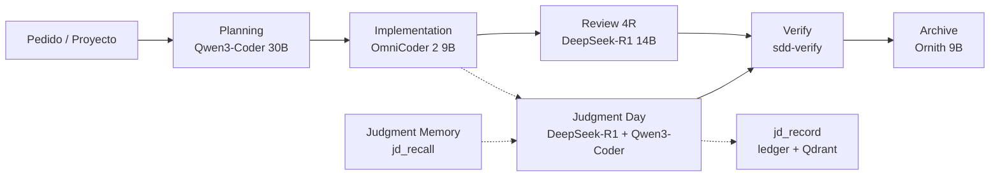
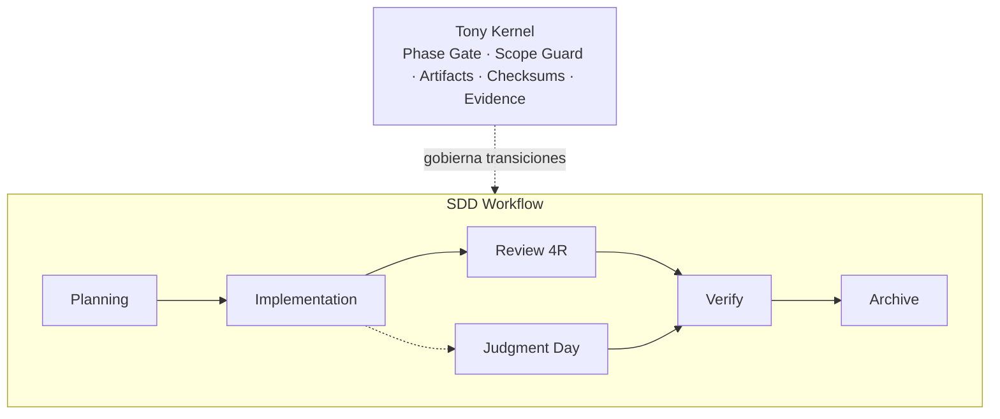

# Tony-AI
`Tony-AI` es un sistema de orquestación de agentes de IA para desarrollo de software basado en Spec-Driven Development (SDD), que utiliza múltiples LLMs locales y memoria persistente para planificar, implementar, revisar y reutilizar conocimiento operativo de los cambios realizados.  
Combina tres subsistemas principales:   

* `local-memory/` — servidor MCP de memoria persistente y duradera basada en SQLite.
* `code-index/` — indexación y búsqueda semántica del código mediante Ollama + Qdrant.
* `judgment-memory/` — almacenamiento y recuperación de decisiones, revisiones y juicios previos para reutilizar conocimiento durante futuras tareas.

La configuración de OpenCode almacena las bases SQLite persistentes de TonyMem y Judgment Memory bajo `.tonymem/`:

```text
.tonymem/memory.db
.tonymem/judgment-memory.db
```

Los servicios definidos en `docker/` proporcionan la infraestructura local para Ollama y Qdrant cuando estos servicios no están disponibles en el host.   

## ¿Cómo funciona?
`Tony-AI` orquesta el desarrollo de software mediante un flujo de trabajo basado en **Spec-Driven Development (SDD)**. El proceso separa la planificación de la implementación, la revisión, la verificación y el archivado, y utiliza agentes especializados para cada etapa.

El flujo general es:
**exploración → propuesta → spec → diseño → tareas → implementación → revisión → verificación → archivado**

**Tony Kernel** actúa como capa de control del flujo. Intercepta las transiciones entre fases y valida que cada etapa haya producido los artifacts y la evidencia necesarios antes de permitir avanzar.  

Entre sus controles se incluyen la validación de artifacts, verificación de checksums, scope guard y comprobaciones de evidencia.   
Si una condición obligatoria falla, la transición se bloquea y se informa el motivo exacto.

## Flujo de agentes
El trabajo comienza con el **Planning Engine**, que analiza el pedido y construye el contexto necesario para trabajar sobre el repositorio. A partir de esa planificación, el agente de **Implementation** realiza los cambios correspondientes.

Después de implementar, `Tony-AI` puede ejecutar una **Revisión 4R** para analizar los cambios y, cuando se solicita explícitamente un juicio, activar **Judgment Day**. Judgment Day recupera juicios anteriores relevantes antes de evaluar el cambio y registra el resultado una vez finalizado el juicio.

Finalmente, **Verify** ejecuta las verificaciones definidas por el flujo SDD. Cuando la implementación supera las validaciones requeridas, el proceso puede pasar a **Archive**, donde se consolida el estado final del trabajo.


## Contexto y memoria
Tony-AI separa la orquestación del workflow de los sistemas que aportan contexto y memoria.

```text
                         OpenCode
                            │
                   Tony Orchestrator
                    │       │       │
                    │       │       └── Judgment Memory
                    │       └────────── Code Index
                    └────────────────── TonyMem
                            │
                           DCP
                            │
                         SDD phase
                            │
                       Tony Kernel
```

- **TonyMem** aporta decisiones, descubrimientos y contexto persistente.
- **Code Index** aporta conocimiento semántico sobre el código.
- **Judgment Memory** aporta juicios y lecciones de revisiones anteriores.
- **DCP** administra el contexto utilizado por OpenCode.
- **Tony Kernel** no decide qué trabajo hacer: controla si una transición de fase está permitida.

La persistencia SQLite configurada para OpenCode se encuentra en `.tonymem/`; los directorios `local-memory/` y `judgment-memory/` contienen los servidores MCP que acceden a esas bases.

El objetivo no es entrenar los modelos, sino conservar, indexar y recuperar conocimiento operativo para reutilizarlo en tareas posteriores.

```text
Nueva tarea
    │
    ├── TonyMem ──────────────► decisiones y contexto previo
    ├── Code Index ───────────► código relacionado
    ├── Judgment Memory ──────► revisiones y lecciones previas
    └── DCP ──────────────────► contexto relevante
                                      │
                                      ▼
                               Agente / Orchestrator
                                      │
                                      ▼
                                 SDD Phase
                                      │
                                      ▼
                                 Tony Kernel
```							   
## Kernel
Si algo falla, el Kernel te dice exactamente por qué:

- **Artifacts faltantes o con hash inválido** → volvé a generar el artifact de la fase actual
- **Diff fuera de allowed_files** → revisá el scope en `openspec/change-request.md`
- **Salto de fase** → completá la fase anterior antes de avanzar

El Kernel comprueba que el cambio esté en condiciones de avanzar antes de permitir la siguiente fase.   
Entre otras cosas, controla: artifacts requeridos; checksums; alcance permitido de los cambios; evidencias; estado de la fase; transiciones válidas.   
Esto permite que el workflow no dependa únicamente de que un agente "recuerde" qué debe hacer: las condiciones críticas del proceso son verificadas por una capa de control.
	
## Arquitectura
                         ┌──────────────────────────┐
                         │        OpenCode          │
                         │   Agent Orchestrator     │
                         │          + SDD           │
                         └────────────┬─────────────┘
                                      │
                         ┌────────────▼─────────────┐
                         │       Tony Kernel        │
                         │                          │
                         │ Phase Gate · Scope Guard │
                         │ Artifacts · Checksums    │
                         │ Evidence · Transitions   │
                         └────────────┬─────────────┘
                                      │
                 ┌────────────────────┼────────────────────┐
                 │                    │                    │
                 ▼                    ▼                    ▼
        ┌────────────────┐   ┌────────────────┐   ┌──────────────────┐
        │ local-memory   │   │   code-index   │   │ judgment-memory  │
        │                │   │                │   │                  │
        │ Memoria        │   │ Búsqueda       │   │ Memoria de       │
        │ persistente    │   │ semántica      │   │ juicios          │
        │ SQLite         │   │ del código     │   │                  │
        └───────┬────────┘   └───────┬────────┘   └────────┬─────────┘
                │                    │                     │
                ▼                    ▼                     ▼
        ┌──────────────┐      ┌────────────────┐    ┌────────────────┐
        │    SQLite    │      │ Ollama +       │    │ SQLite +       │
        │              │      │ Qdrant         │    │ Qdrant         │
        │ decisiones + │      │ embeddings +   │    │ ledger +       │
        │ contexto     │      │ vector search  │    │ recuperación   │
        └──────────────┘      └────────────────┘    └────────────────┘
Para una descripción más profunda de los componentes y sus interfaces, consultá [ARCHITECTURE.md](ARCHITECTURE.md)

# Requisitos
- **Python 3.10+** — servidores MCP y tooling Python.
```bash
sudo apt update && sudo apt upgrade -y
sudo apt install -y python3 python3-pip python3-venv
echo 'export PATH="$HOME/.local/bin:$PATH"' >> ~/.bashrc
source ~/.bashrc
python3 --version
python3 -m pip --version
```
- **Bun** — scripts TypeScript y plugins.
```bash
sudo apt update && sudo apt install -y unzip curl && curl -fsSL https://bun.sh/install | bash
source ~/.bashrc
bun --version
```
- **OpenCode CLI** — orquestador SDD.
```bash
curl -fsSL https://opencode.ai/install | bash
source ~/.bashrc
opencode --version
```
- **Ollama** — ejecución de LLM locales.
```bash
sudo apt-get install zstd
curl -fsSL https://ollama.com/install.sh | sh
source ~/.bashrc
ollama --version
curl http://localhost:11434/api/tags
```
- **Docker + Docker Compose** — infraestructura de servicios, incluido Qdrant.
```bash
curl -fsSL https://get.docker.com | sudo sh
sudo usermod -aG docker $USER && newgrp docker
docker --version
docker compose version
```
- **GGA (Gentleman Guardian Angel)** — code review. 
Se instala automáticamente desde `scripts/setup.sh`
- **tree-sitter** — chunking estructural del Code Indexer.  
- **tree-sitter-language-pack** — grammars utilizadas por el Code Indexer.

## Modelos locales por defecto

| Función | Modelo |
|---|---|
| Planning / propuesta | `qwen3-coder:30b` |
| Implementación | `carstenuhlig/omnicoder-2-9b:q4_k_m` |
| Review / Judgment | `deepseek-r1:14b` |
| Archive / jd-fix-agent | `ornith:9b` |
| Code embeddings | `bge-m3` |
| Judgment embeddings | `nomic-embed-text` |

Los modelos se ejecutan localmente mediante Ollama.

# Instalación

```bash
git clone https://github.com/gastoncelestino/tony-ai.git
cd tony-ai
git checkout dev
./scripts/setup.sh
```
Valida las dependencias, instala `requirements-dev.txt`, tree-sitter, levanta los servicios Docker, descarga todos los modelos, genera `.env.example` y configuración de OpenCode.

Después:

```bash
./scripts/health.sh
```
Es el chequeo de salud end-to-end de `Tony-AI`. No instala ni configura cosas: verifica que el sistema ya configurado funcione.

Para la instalación detallada, consultá [INSTALL.md](INSTALL.md).

# ¿Cómo se usa?
```bash
# 1. Inicializá el proyecto (una sola vez)
/sdd-init
```

```bash
# 2. Creá un cambio nuevo
/sdd-new "agregar rate limiting al endpoint de login"

El orquestador hace el trabajo pesado: explora el código, arma una propuesta, genera la spec, el diseño y las tareas. Podés intervenir en cualquier momento:

/sdd-explore "chequear si hay middleware de auth existente"
/sdd-propose   # ajustar la propuesta si hace falta
/sdd-design    # modificar el diseño antes de implementar
```

```bash
# 3. Implementar y verificar
/sdd-apply                    # implementá las tareas
/sdd-verify                   # validá contra las specs
/sdd-archive                  # cerrá el cambio
```

```bash
# 4. Consultá memoria en cualquier momento
/memory-search "rate limiting"
/memory-stats
/judgment-history
/kernel-status                # estado actual del Kernel (fase, artifacts, checksums)
```

```bash
# 5. Iterar sobre un cambio existente
Para retomar un cambio anterior:

/sdd-load <change-id>          # retomá un cambio anterior
/sdd-apply                     # seguí con las tareas pendientes
/sdd-verify                    # re-validá si tocaste specs
/sdd-archive                   # cerrá la nueva iteración
```

```bash
# 6. Activar Judgment Day

`juzgar esto` recupera juicios anteriores relevantes, ejecuta los dos jueces configurados y registra el resultado en Judgment Memory para futuras revisiones.

Actualmente la configuración incluye:
- `jd-judge-a`
- `jd-judge-b`

- Resultado podría ser:
	- JUDGMENT: APPROVED ✅ (ambos jueces de acuerdo)
	- JUDGMENT: ESCALATED ⚠️ (encontraron cosas, necesita tu revisión)
```

```bash
# 7. TonyMem - Memoria Persistente
Almacena en SQLite (en `.tonymem/memory.db`):

# Ya está automático con los hooks, pero si querés guardar explícitamente algo:
mem_save(
  task="manejo retry HTTP",
  observation="usar exponential backoff"
)

# Cuando trabajás en una tarea nueva, TonyMem busca automáticamente:
mem_search("retry HTTP") → encuentra la decisión guardada

# Ciclo práctico: 
# Sesión 1: Implementas manejo de reintentos
/sdd-new "agregar reintentos en HTTP client"
/sdd-apply
# Se guarda automáticamente: task="retry HTTP", observation="exponential backoff"

# Sesión 2: Necesitás manejar reintentos en otro lugar
/sdd-new "agregar reintentos en queue processor"
mem_search("retry HTTP")  # ← recupera la decisión anterior
# TonyMem sugiere: "recordamos que usaste exponential backoff"
```

```bash
# 8. Judgment Memory - Lecciones de Revisiones
Cuando termina Judgment Day, TonyMem registra automáticamente:
jd_record(
  task="validar JWT", 
  final="approve",  # o "escalated"
  lesson="siempre verificar signature expiration"
)

# En futuras tareas similares
La próxima vez que alguien trabaje con JWT, Judgment Memory recupera:
jd_recall(task="validar JWT")
# Devuelve: "recordamos que el último JWT validado necesitaba verificar expiration"

# Ciclo práctico:
# Sesión 1: Implementas validación JWT
/sdd-apply       # código JWT
/sdd-verify
/sdd-archive
juzgar esto      # dos jueces review
# RESULTADO: Ambos confirman que hay que verificar expiration
# Se guarda: lesson="siempre verificar signature expiration"

# Sesión 2: Nuevo código de JWT en otro módulo
/sdd-new "agregar JWT refresh"
jd_recall("JWT")  # ← se ejecuta automáticamente en step 1 de judgment-day
# Judgment Memory dice: "vimos antes que necesitas verificar expiration"
# Los jueces revisan con ese contexto
```

```bash
# 9. Code Indexer - Conocimiento del Codebase
Pregunta semántica sobre tu codebase
code_search("cómo se maneja la autenticación")
# Resultado: te encuentraa funciones, modules y patrones relacionados a auth
# aunque no tengan esa palabra exacta

code_search("validación de entrada")
# Encuentra helpers, validators, middlewares que hacen validación

# Ciclo práctico:
# Sesión: Necesitás agregar rate limiting
/sdd-new "agregar rate limiting"
# Durante el explore:
code_search("cómo se protegen los endpoints")
# Code Indexer encuentra: middleware de auth, validaciones anteriores
# con ese contexto, propone una solución similar
```

```bash
# 10. Cómo funciona el aprendizaje en práctica:
** Recuperación de contexto previo
1. /sdd-new → delega sdd-explore + sdd-propose a sub-agentes
   # Los sub-agentes empiezan de cero

2. mem_search() → encuentra decisión previa sobre JWT
   # Busca en TonyMem: "¿hemos hablado de JWT antes?"
   # Encuentra: "decisión anterior: usar RS256 para firmar"

3. code_search() → encuentra cómo funciona auth actual
   # Code Indexer busca: "¿cómo está implementada la autenticación?"
   # Encuentra: módulo de login, middleware de validation

4. jd_recall() → recuerda lección sobre token expiration
   # Judgment Memory busca: "¿qué aprendimos de reviews de JWT?"
   # Encuentra: "siempre verificar expiration del token"
   
- Resultado: Los agentes NO parten de cero, tienen contexto de decisiones, código y lecciones anteriores.


** Implementación + Aprendizaje
5. /sdd-tasks → genera plan con ese contexto
   # Usa lo que encontró en pasos 2-4

6. /sdd-apply → implementa las tareas
   # Hooks capturan automáticamente lo que se hace

7. /sdd-verify → valida contra specs
   # Asegura que respete el diseño

8. /sdd-archive → cierra el cambio, guarda archive-report
   # Registra la decisión para futuro

9. juzgar esto → dos jueces review
   # Revisan la implementación
   # Si encuentran lecciones → se guardan en Judgment Memory
   
El ciclo de aprendizaje
Primera implementación (Sesión 1)
    ↓
    ├─ Se toman decisiones (JWT + RS256)
    ├─ Se encuentran bugs (expiration no se verificaba)
    ├─ Los jueces descubren → lesson guardada
    ↓
Semanas después (Sesión 2)
    ↓
    └─ Nuevo request de JWT
        ├─ mem_search() recupera: "RS256 es nuestro standard"
        ├─ jd_recall() advierte: "verificar expiration"
        ├─ code_search() muestra el código anterior
        └─ Resultado: implementación 10x más rápida y correcta

- Cada componente se alimenta del anterior:
TonyMem (decisiones) ← de /sdd-archive
Code Index (código) ← indexa automáticamente
Judgment Memory (lecciones) ← de juzgar esto
Hooks (contexto) ← captura mientras trabajás
Siguiente tarea ← recupera TODO esto
```

```bash
# 11. Cómo se reutiliza el conocimiento
Usuario
  │
  │ "Implementa login con refresh token"
  ▼
/sdd-new
  │
  ├── sdd-explore
  ├── sdd-propose
  │
  ├─── 🔄 RECUPERACIÓN (Ranking de Prioridad)
  │    │
  │    ├─ 1️⃣ jd_recall()  [PRIORIDAD ALTA]
  │    │      └── recupera lecciones de revisiones anteriores
  │    │          (Judgment Memory - vigencia 90 días si APPROVED)
  │    │
  │    ├─ 2️⃣ mem_search()  [PRIORIDAD MEDIA]
  │    │      └── recupera decisiones previas
  │    │          (TonyMem - vigencia 30 días)
  │    │
  │    └─ 3️⃣ code_search()  [PRIORIDAD BAJA]
  │           └── encuentra código relacionado
  │               (Code Index - sin expiración)
  │
  ├─── ⚡ RESOLVER CONFLICTOS
  │    │ Si se contradicen:
  │    └─ lesson > decision > code
  │
  ├── sdd-tasks
  │
  ├── sdd-apply
  │
  ├── sdd-verify
  │
  ├── sdd-archive
  │    │
  │    └─ 💾 PERSISTENCIA
  │       ├─ TonyMem (decisión)      → 30 días vigencia
  │       └─ Code Index (código)     → indexado permanentemente
  │
  └── juzgar esto
         │
         ├── jueces [lee independientemente]
         │
         └── jd_record()
              │
              └─ 💾 PERSISTENCIA con PRIORIDAD
                 ├─ Si APPROVED   → Judgment Memory (90 días)
                 ├─ Si ESCALATED  → Judgment Memory (sin vigencia)
                 │                  [marcado como crítico]
                 │
                 └─ Nueva lección → alimenta jd_recall()
                    de futuras revisiones

# El conocimiento generado persiste y se jerarquiza:
- Las lecciones de errores (Judgment) duran 90 días (si APPROVED)
- Las decisiones normales duran 30 días
- El código indexado crece sin expiración

# Almacena en tres sistemas con propósitos distintos:
- TonyMem → decisiones y descubrimientos (búsqueda: 30 días vigencia)
- Judgment Memory → lecciones de errores encontrados (búsqueda: 90 días si APPROVED)
- Code Index → patrones del código (búsqueda: permanente, crece con codebase)

# Recuperación jerárquica en nuevas tareas:
- Primero: lecciones de revisiones anteriores (si existen)
- Luego: decisiones implementadas (si aún son vigentes)
- Finalmente: patrones de código similar
** Si hay contradicción, la lección gana (lesson > decision > code)"
```
## Comandos
| Comando | Descripción | Fuente | Offline |
|---------|-------------|--------|---------|
| `/sdd-init` | Inicializar contexto SDD | SQLite + config | ✅ |
| `/sdd-new <change>` | Nuevo cambio con SDD completo | Sub-agentes planning | ❌ |
| `/sdd-explore <task>` | Investigar una idea | Sub-agente explore | ❌ |
| `/sdd-propose` | Crear propuesta PRD | Sub-agente propose | ❌ |
| `/sdd-spec` | Especificación técnica | Sub-agente spec | ❌ |
| `/sdd-design` | Diseño técnico | Sub-agente design | ❌ |
| `/sdd-tasks` | Generar plan de tareas | Sub-agente tasks | ❌ |
| `/sdd-apply [change]` | Implementar tareas | Sub-agente writer | ❌ |
| `/sdd-verify [change]` | Validar implementación | Sub-agente verify | ❌ |
| `/sdd-archive [change]` | Cerrar cambio y archivar | SQLite/JSON | ✅ |
| `/sdd-onboard` | Walkthrough guiado de SDD | Sub-agente onboard | ❌ |
| `/sdd-status [change]` | Ver estado del cambio | Artifact store | ✅ |
| `/sdd-continue [change]` | Ejecutar siguiente fase | Sub-agentes | ❌ |
| `/sdd-ff <name>` | Fast-forward: propuesta → tareas | Sub-agentes planning | ❌ |
| `/memory-search "query"` | Búsqueda semántica en TonyMem + Judgment Memory | SQLite + Qdrant | ✅ / ❌ |
| `/memory-stats` | Estadísticas de memoria | SQLite | ✅ |
| `/judgment-history [project]` | Ver historial de juicios | SQLite ledger | ✅ |
| `juzgar esto` | Activar Judgment Day | 2 jueces + memoria | ❌ |
| `/kernel-status` | Estado del Kernel (fase actual, artifacts, checksums) | kernel-state.json | ✅ |
| `/kernel-reset` | Resetear estado del Kernel (solo desarrollo) | kernel-state.json | ✅ |

💡 Todo funciona offline excepto los comandos que requieren sub-agentes (`/sdd-new`, `/sdd-explore`, `/sdd-propose`, `/sdd-spec`, `/sdd-design`, `/sdd-tasks`, `/sdd-apply`, `/sdd-verify`, `/sdd-onboard`, `/sdd-continue`, `/sdd-ff`, `juzgar esto`) y búsqueda semántica (`/memory-search` con Qdrant/Ollama).

## Testing
Tony-AI separa las pruebas de código de las verificaciones que requieren infraestructura externa.
La suite local **no necesita Ollama, Qdrant ni Docker**. Esto permite ejecutar la mayoría de las pruebas incluso en un entorno sin los servicios de IA configurados.
- **Python + pytest** para desarrollo y CI.
- **Runner Python standalone** (`tools/run-python-tests.py`) sin dependencias externas.
- **Bun** para los tests TypeScript.
- **Validación directa de configuración y prompts SDD**.
- **Tests focalizados del Tony Kernel**.
- **Tests de integración del plugin Judgment Memory**.

La ejecución recomendada es:
```bash
python3 -m pip install -r requirements-dev.txt
make test
```
También pueden ejecutarse las suites individualmente:
```bash
make test-python
make test-ts
make test-kernel
```

Para ejecutar Python sin pytest:
```bash
python3 tools/run-python-tests.py tests
```

## Categorías de tests
Los tests Python pueden filtrarse por categoría:
```bash
python3 -m pytest -m concurrency
python3 -m pytest -m mcp
python3 -m pytest -m "not concurrency"
```

## Code Review automático
`GGA` valida los archivos staged contra tu `AGENTS.md` antes de cada commit, usando OpenCode como proveedor de IA.
El repo ya incluye `.gga` (config) y el agente `gga-reviewer` en `opencode.json`. Solo falta instalar el hook:
```bash
gga install          # crea .git/hooks/pre-commit (local, no se commitea)
gga config           # verificar configuración
gga run              # revisar archivos staged
gga run --pr-mode    # revisar todos los cambios del PR vs main
gga run --no-cache   # ignorar cache y revisar todo
```

## Documentación
[INSTALL.md](INSTALL.md) — instalación y configuración detallada.  
[ARCHITECTURE.md](ARCHITECTURE.md) — arquitectura interna y componentes.  
[AGENTS.md](AGENTS.md) — define las reglas de comportamiento y desarrollo que deben seguir los agentes.  
[TESTING.md](TESTING.md) — es la guía oficial de estrategia y ejecución de pruebas.  

## Estado del proyecto
`Tony-AI` está diseñado para ejecutarse localmente, manteniendo los modelos, memoria y datos semánticos bajo control del entorno del desarrollador.

El objetivo no es solamente generar código con LLMs, sino proporcionar un workflow de desarrollo verificable, persistente y basado en especificaciones, donde los agentes pueden reutilizar el conocimiento acumulado del proyecto y donde el Kernel controla las condiciones necesarias para avanzar entre fases.

## Agradecimientos
Algunos conceptos de SDD, orquestador, prompts, skills y comandos se basan en el repositorio de github `gentle-ai` de Alan Buscaglia (`The Gentleman`), a quien agradecemos por su contenido y aportes a la comunidad.
