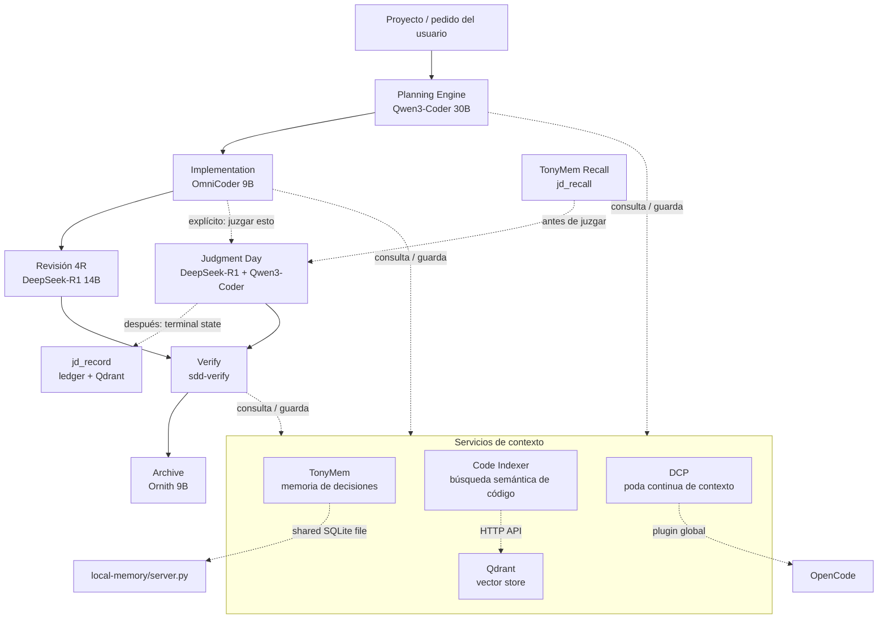

# Tony-AI
Tony-AI es un sistema de orquestación de agentes de IA para desarrollo de software que utiliza un flujo de trabajo de 
Desarrollo Guiado por Especificaciones (SDD) con múltiples LLMs locales. 
Herramientas locales de IA centradas en **memoria persistente**, **búsqueda semántica de código**, **historial de juicios** para un orquestador de estilo OpenCode/SDD. 
El repositorio combina tres subsistemas principales: `local-memory/` para memoria libre y duradera en SQLite,  `code-index/` para búsqueda semántica sobre código fuente usando Ollama + Qdrant, y `judgment-memory/` para almacenar y recuperar resultados previos de revisiones/juicios. 
Los assets de Docker en `docker/` proporcionan los servicios de soporte locales de Ollama y Qdrant utilizados por los componentes semánticos.

## ¿Cómo funciona?
La idea central es buena: el orquestador trabaja por fases. Primero explora/propuesta/spec/diseño/tareas, después implementa, luego verifica y finalmente archiva. 
Mientras tanto, TonyMem guarda decisiones y contexto entre sesiones, code-index te deja buscar "por significado" dentro del repo, y judgment-memory recuerda revisiones anteriores parecidas para no arrancar siempre desde cero. 
Es un enfoque bastante más serio que "preguntarle cosas al modelo y ya". 

A nivel técnico, el stack pide Python 3.10+, Bun, Ollama, Qdrant y opcionalmente Docker para levantar los servicios auxiliares. 
Los modelos por defecto son pesados: qwen3-coder:30b, omnicoder:9b, deepseek-r1:14b, ornith:9b, y embeddings con bge-m3 y nomic-embed-text. 

## ¿Qué es SDD?
Spec-Driven Development es un enfoque estructurado para construir cambios en software a través de ocho fases:

1. **Explorar** — Investigar ideas, leer código, comparar enfoques
2. **Proponer** — Crear una propuesta de cambio con contexto de negocio
3. **Especificación** — Escribir especificación técnica detallada
4. **Diseño** — Definir arquitectura técnica y estructuras de datos
5. **Tareas** — Desglosar specs en tareas implementables
6. **Aplicar** — Implementar el cambio
7. **Verificar** — Validar implementación contra specs
8. **Archivar** — Cerrar el cambio con estado final

## Qué incluye este repositorio
- **TonyMem (`local-memory/`)**: un servidor MCP en Python con solo stdlib que proporciona memoria local persistente en SQLite, incluyendo herramientas para guardar, buscar, actualizar, resumen de sesión y recuperación contextual.
- **Code Indexer (`code-index/`)**: búsqueda semántica sobre un codebase, usando llamadas HTTP a Ollama para embeddings y Qdrant para almacenamiento vectorial.
- **Judgment Memory (`judgment-memory/`)**: un puente que almacena la salida final de flujos de revisión/juicio para que tareas futuras similares puedan recuperar resultados previos en lugar de empezar desde cero.
- **Servicios de Docker (`docker/`)**: archivos Compose y documentación para correr Ollama y Qdrant localmente.
- **Assets de agentes (`commands/`, `prompts/`, `skills/`, `plugins/`)**: definiciones de comandos, prompts SDD, skills e integraciones de plugins usadas por la capa de orquestación.

## Visión general de la arquitectura
```text
                         ┌──────────────────────┐
                         │     OpenCode / SDD   │
                         │     Orquestador      │
                         └──────────┬───────────┘
                                    │
                 ┌──────────────────┼──────────────────┐
                 │                  │                  │
                 ▼                  ▼                  ▼
        ┌───────────────┐   ┌───────────────┐  ┌─────────────────┐
        │ local-memory  │   │  code-index   │  │ judgment-memory │
        │ memoria SQLite│   │ RAG semántico │  │ recuperación de │
        │               │   │               │  │ juicios         │
        └──────┬────────┘   └──────┬────────┘  └────────┬────────┘
               │                   │                    │
               ▼                   ▼                    ▼
         Base de datos      Ollama + Qdrant       SQLite + Qdrant
         SQLite              para embeddings       para juicios
```

## Cómo funciona (visión general)


## Patrón de memoria: archivo "SQLite compartido"
El diseño central de Tony-AI es que **cada servicio de memoria tiene un servidor MCP (Python) y un plugin (Bun) que comparten el mismo archivo SQLite**:
```
┌─────────────────────────┐    ┌─────────────────────────┐
│  local-memory/server.py │    │   plugins/tonymem.ts    │
│  (MCP server, 8 tools)  │    │  (OpenCode hooks)       │
│                         │    │                         │
│  SQLite: memory.db      │◄──►│  bun:sqlite (WAL mode)  │
│  observations table     │    │  same file, same schema │
└─────────────────────────┘    └─────────────────────────┘

┌─────────────────────────┐    ┌─────────────────────────┐
│  judgment-memory/       │    │  plugins/judgment-      │
│  ledger.py + server.py  │    │  memory.ts + qdrant.ts  │
│  (MCP server, 4 tools)  │    │  (OpenCode hooks)       │
│                         │    │                         │
│  SQLite: judgment-      │◄──►│  bun:sqlite (WAL mode)  │
│  memory.db              │    │  same file, same schema │
│  judgments table        │    │                         │
│                         │    │  HTTP → Qdrant/Ollama   │
│  Qdrant: jdmem_{proj}   │◄──►│  (via plugins/qdrant.ts)│
└─────────────────────────┘    └─────────────────────────┘
```
Este patrón permite un acceso directo al archivo SQLite en modo WAL, que es el modo de concurrencia que SQLite está diseñado para soportar: un escritor a la vez, lectores nunca bloquean.

## Tres conceptos clave:
1. **Judgment Day no corre en paralelo con revisión 4R.**  
   Por defecto, después de la implementación corre la revisión 4R ordinaria (`review-risk/readability/reliability/resilience` + `review-refuter`). Judgment Day (dos jueces ciegos, `jd-judge-a`/`jd-judge-b`) solo se activa explícitamente — nunca ambos a la vez.

2. **TonyMem, Code Indexer/Qdrant y DCP trabajan en cada fase.**  
   Se consultan y escriben durante cada fase (contexto previo antes de arrancar, guardado de decisiones al terminar, poda de contexto continua). No hay una etapa "leer memoria" al final del pipeline.

3. **Judgment Day tiene memoria propia.**  
   Antes de lanzar a los jueces, se llama `jd_recall` (¿ya vimos un problema parecido?). Cuando la lineage llega a un estado terminal, el orquestador llama `jd_record`, que persiste en un ledger SQLite propio (`judgment-memory/ledger.py`) y lo embebe/indexa en Qdrant (colección `jdmem_{project}`, separada del Code Indexer). Ver `judgment-memory/README.md`.

## Componentes

## Servicios de contexto
- **TonyMem** — Memoria persistente para decisiones, hallazgos y compartición de contexto entre sesiones.
- **Code Indexer + Qdrant** — Búsqueda semántica sobre el código usando embeddings locales.
- **Poda de Contexto Dinámica (DCP)** — Gestión automática de la ventana de contexto.

## Judgment Day
Cuando se activa explícitamente (por keywords como "juzgar" o "dual review"), ejecuta dos jueces de IA independientes:
- `jd-judge-a` (DeepSeek-R1 14B)
- `jd-judge-b` (Qwen3-Coder 30B) — deliberadamente distinto de `jd-judge-a` para verdadera corroboración

Antes de juzgar, `jd_recall` busca juicios similares anteriores. Después de completar, `jd_record` persiste el veredicto.

## Prerequisitos (lo que tenes que instalar para que funcione)
- **Python 3.10+** para los servidores MCP en Python.
- **Bun** para los scripts de verificación basados en TypeScript y plugins.
- **Docker** si querés los servicios de Qdrant + Ollama.
- **OpenCode CLI** (instalador oficial: https://opencode.ai)
- **Ollama** (https://ollama.com/download)

## Requerido para características semánticas
- **Qdrant** corriendo localmente o remotamente.
- La capa de memoria local funciona sin Ollama ni Qdrant. La búsqueda semántica de código y el recall de juicios requieren ambos servicios.

## 1. Clonar repositorio
```bash
git clone https://github.com/gastoncelestino/tony-ai.git
cd tony-ai
```

## Crear la carpeta .opencode en tu perfil de usuario si no existe
```bash
mkdir "$env:USERPROFILE/.opencode"
mkdir "$env:USERPROFILE/.opencode/plugins"
```

## Copiar opencode.json
```bash
copy /tony-ai/opencode.json "$env:USERPROFILE/.opencode/opencode.json"
```

## Copiar AGENTS.md
```bash
copy /tony-ai/AGENTS.md "$env:USERPROFILE/.opencode/AGENTS.md"
```

## Copiar los plugins TypeScript
```bash
copy /tony-ai/plugins/tonymem.ts "$env:USERPROFILE/.opencode/plugins/"
copy /tony-ai/plugins/qdrant.ts "$env:USERPROFILE/.opencode/plugins/"
copy /tony-ai/plugins/judgment-memory.ts "$env:USERPROFILE/.opencode/plugins/"
```

## Deberías ver algo como:
```bash
├── opencode.json
├── AGENTS.md
├── plugins/
│   └── tonymem.ts
│	└── qdrant.ts
│	└── udgment-memory.ts

📄 opencode.json
📄 AGENTS.md
📁 plugins
   📄 tonymem.ts
   📄 qdrant.ts
   📄 judgment-memory.ts
```

## 2. Iniciar Ollama y Qdrant con Docker Compose
```bash
cd docker
cp .env.example .env   # opcional
docker compose up -d  # inicia Qdrant (vector DB) en el puerto 6333 y Ollama en el puerto 11434
docker compose ps
```bash
Deberías ver algo como:
NAME            IMAGE                  COMMAND                  SERVICE             STATUS           PORTS
tony-ai-qdrant  qdrant/qdrant:latest   "/bin/qdrant --config…"  qdrant              running (healthy)  0.0.0.0:6333->6333/tcp
tony-ai-ollama  ollama/ollama:latest   "/usr/bin/ollama bind_…" ollama              running (healthy)  0.0.0.0:11434->11434/tcp
```bash
docker compose logs -f ollama-pull
```

## 3. Descargar modelos de Ollama
## Modelos grandes (descargan lentamente)
```bash
ollama pull qwen3-coder:30b
ollama pull deepseek-r1:14b
```
## Modelos medianos
```bash
ollama pull omnicoder:9b
ollama pull ornith:9b
```
## Modelos pequeños (rápidos)
```bash
ollama pull bge-m3
ollama pull nomic-embed-text
```

## 4. Correr el suite de tests

## correr tests de Python + TypeScript. Deberías ver algo como: [PASS] ...  ✅ Todos los tests pasaron
```bash
make test
```
[PASS] chunk_lines handles empty input
[PASS] content_hash produces correct hash
[PASS] embed_texts handles batch
[PASS] qdrant_upsert and search roundtrip via mock
[PASS] point_id deterministic per project+path+start_line
[PASS] collection name sanitization
[PASS] qdrant client methods (embed/upsert/search/delete) via mock server
[PASS] index_repo incremental: unchanged files skipped, changed files re-indexed, deleted files removed
...
[PASS] All test_hooks passed
Total tests: 11
Passed: 11
Failed: 0

ALL ASSERTIONS PASSED

[PASS] test_treesitter_chunking
  tree-sitter chunking produced 4 chunks from nested Python
ALL TESTS PASSED
 ✨  test_core.py (Python)
✅ test_hooks.ts (TypeScript)

Si todos los tests pasan (Passed: 11 / All tests passed), entonces tu instalación de Tony-AI está completa y funciona correctamente.

```bash
make verify-qdrant   # probar el pipeline vectorial real Qdrant
make docker-up       # iniciar servicios Docker
make docker-down     # detener servicios Docker
make clean           # eliminar bases de datos/index SQLite locales
```

## 5. Verificar el pipeline real de Qdrant/Ollama
```bash
opencode mcp list
```

## Correr el indexador de código
```bash
cd code-index
python3 core.py index --path /ruta/al/repo --project mi-proyecto
python3 core.py search --query "manejo de reintentos HTTP" --project mi-proyecto
python3 core.py status --path /ruta/al/repo --project mi-proyecto
```

## Correr tests de judgment-memory
```bash
cd judgment-memory
python3 test_ledger.py
```

## Correr local-memory manualmente
```bash
cd local-memory
python3 server.py
```

| Componente 						| Test 											| Qué cubre 																	|
|-----------------------------------|-----------------------------------------------|-------------------------------------------------------------------------------|
| TonyMem server 					| `local-memory/server.py` (manual JSON-RPC) 	| Sesión completa: save, search, context, session-summary, prompt-capture 		|
| TonyMem plugin 					| `plugins/tonymem.ts` (tipado `tsc`) 			| Tipado contra stubs de `bun:sqlite`/`@opencode-ai/plugin` 					|
| Code Indexer 						| `code-index/test_core.py` 					| Chunking + mock HTTP end-to-end, 4/4 escenarios 								|
| DCP config 						| validado contra `dcp.schema.json` 			| Schema completo, `additionalProperties: false` 								|
| Judgment Day Memory Bridge 		| `judgment-memory/test_ledger.py` 				| Mock Ollama+Qdrant, 7/7 escenarios incl. camino feliz 						|
| Judgment Day Memory Bridge 		| `judgment-memory/test_hooks.ts` 				| Hooks de plugin (`chat.message`, `tool.execute.after`, `system.transform`) 	|
| Judgment Day Memory Bridge 		| `judgment-memory/scripts/verify-qdrant.ts` 	| Smoke test del cliente TS contra servicios reales 	

## Estructura del proyecto
```
tony-ai/
├── README.md                          # este archivo
├── opencode.json                      # mcp.tonymem/code-index/judgment-memory + Model Router
├── AGENTS.md                          # Reglas + Idioma + Instrucciones + TonyMem + Code Indexer
├── config/
│   └── tony-memory.yaml               # referencia documentada de env vars
├── docker/
│   ├── docker-compose.yml             # Ollama + Qdrant (backing services)
│   ├── docker-compose.gpu.yml         # override opcional, passthrough NVIDIA
│   ├── .env.example
│   └── README.md                      # notas específicas NixOS
├── Makefile                           # wrappers de conveniencia sobre tests
├── plugins/
│   ├── tonymem.ts                     # memoria local SQLite
│   ├── qdrant.ts                      # cliente REST Qdrant + Ollama (TS)
│   └── judgment-memory.ts             # bridge: recall antes de JD, captura después
├── local-memory/                      # TonyMem — MCP server (8 tools)
│   ├── server.py
│   └── README.md
├── code-index/                        # Code Indexer + Qdrant — MCP server (3 tools)
│   ├── core.py
│   ├── server.py
│   ├── test_core.py                   # regression test (mock Ollama/Qdrant)
│   └── README.md
├── judgment-memory/                   # Judgment Day <-> TonyMem bridge
│   ├── ledger.py                      # SQLite ledger + normalize + embed + Qdrant
│   ├── server.py                      # jd_recall / jd_record / jd_history / jd_stats
│   ├── schema.json                    # shape de un judgment record
│   ├── test_ledger.py                 # regression test (mock Ollama/Qdrant)
│   ├── test_hooks.ts                  # test harness para hooks de plugin
│   ├── __mocks__/                     # mocks para tests
│   │   ├── opencode-plugin.ts         # mock del Plugin context + eventos
│   │   └── http-mock.ts               # mock HTTP para Ollama/Qdrant
│   ├── scripts/
│   │   └── verify-qdrant.ts           # smoke test del cliente TS real
│   └── README.md
├── commands/
│   ├── memory-search.md               # /memory-search — TonyMem + judgment-memory
│   ├── memory-stats.md                # /memory-stats
│   └── judgment-history.md            # /judgment-history — solo SQLite
├── .opencode/
│   └── dcp.jsonc                      # config de DCP (plugin externo)
└── skills/
    ├── judgment-day/SKILL.md          # +paso de recall/record
    └── _shared/
        └── review-ledger-contract.md  
```

## Comandos
|			Comando				|			Descripción								|		Fuente			|  Offline 	|
|-------------------------------|---------------------------------------------------|-----------------------|-----------|
|/sdd-init						|Inicializar contexto SDD							|SQLite + config		|	 ✅		|
|/sdd-explore <task>			|Investigar una idea								|Sub-agente explore		| 	 ❌		|
|/sdd-status [change]			|Ver estado del cambio actual						|Artifact store			|  	 ✅		|
|/sdd-apply	[change]			|Implementar tareas									|Sub-agente writer		|	 ❌		|
|/sdd-verify	[change]		|Validar implementación								|Sub-agente verify		|	 ❌		|
|/sdd-archive	[change]		|Cerrar un cambio									|SQLite/JSON			|	 ✅		|
|/sdd-new "feature"				|Nuevo feature con SDD completo						|Sub-agentes			|	 ❌		|
|/sdd-tasks						|Ver plan de trabajo actual							|Artifact store			|	 ✅		|
|/sdd-ff						|Fast-forward propuesta → tareas					|Sub-agentes planning	|    ❌		|
|/memory-search "query"			|Búsqueda semántica en TonyMem + Judgment Memory	|SQLite + Qdrant		| ✅	❌	|
|/memory-stats					|Estadísticas de uso de memoria						|SQLite					|	 ✅		|
|/mem_save_prompt				|Hook interno de tonymem.ts							|TonyMem				|	 ✅		|
|/judgment-history [project]	|Ver historial de juicios							|SQLite ledger			|	 ✅		|
|juzgar esto: "feature"			|Activar Judgment Day (revisión adversarial)		|2 jueces + memoria		|	 ❌		|

💡 Todo funciona offline excepto `/sdd-explore, /sdd-apply, /sdd-verify, /sdd-new, /sdd-ff, /memory-search y /jd_recall`.

## 💾 Persistencia de Prompts
Hook chat.message → auto-guarda con type='prompt-capture'
Incluido en mem_context por defecto
Excluido de mem_search (bookkeeping)
Filtrar explícitamente: mem_search(query="...", type='prompt-capture')

## Variables de entorno

| Variable 						| Propósito 								| Valor por defecto 					| Usado por 							|
|-------------------------------|-------------------------------------------|---------------------------------------|---------------------------------------|
| `TONY_OLLAMA_URL` 			| Endpoint de Ollama 						| `http://localhost:11434` 				| Todos los servicios de embeddings 	|
| `TONY_QDRANT_URL` 			| Endpoint de Qdrant 						| `http://localhost:6333` 				| Code Indexer, Judgment Memory 		|
| `TONY_EMBED_MODEL` 			| Override del modelo de embeddings 		| `bge-m3` / `nomic-embed-text` 		| Por servicio de embeddings 			|
| `LOCAL_MEMORY_DB` 			| Archivo SQLite para TonyMem 				| `{cwd}/.tonymem/memory.db` 			| TonyMem 								|
| `JUDGMENT_MEMORY_DB` 			| Archivo SQLite para juicios 				| `{cwd}/.tonymem/judgment-memory.db` 	| Judgment Memory 						|
| `TONY_RECALL_SCORE_THRESHOLD` | Score mínimo para superficie de recall	| `0.5` 								| Filtrado de recall de Judgment Memory |

Por defecto, `code-index/` usa `bge-m3` para embeddings de código, mientras que `judgment-memory/` usa `nomic-embed-text` para tareas más cortas de recuperación en lenguaje natural.

## Modelos locales

| Rol 				| Modelo 					| Agentes 																												|
|-------------------|---------------------------|-----------------------------------------------------------------------------------------------------------------------|
| Planificación 	| `ollama/qwen3-coder:30b` 	| `tony-orchestrator`, `sdd-explore`, `sdd-propose`, `sdd-design`, `sdd-spec`, `sdd-tasks`, `sdd-init`, `sdd-onboard` 	|
| Implementación 	| `ollama/omnicoder:9b` 	| `sdd-apply` 																											|
| Revisión 			| `ollama/deepseek-r1:14b` 	| `sdd-verify`, `review-*` (5), `jd-judge-a` 																			|
| Revisión (juez B) | `ollama/qwen3-coder:30b` 	| `jd-judge-b` — deliberadamente distinto de `jd-judge-a` 																|
| Ejecución 		| `ollama/ornith:9b` 		| `sdd-archive`, `jd-fix-agent` 																						|

## Luego de instalar todo, Cómo lo utilizo?
```bash
/sdd-init — inicializar el entorno
```
💡 Tip: La primera vez que uses /sdd-init, vas a necesitar contestar unas preguntas sobre cómo querés trabajar (modo interactivo vs automático, dónde guardar las specs, etc.).


```bash
/sdd-new "mejorar login" — crear un nuevo cambio
/sdd-explore – si necesitás profundizar algo
/sdd-tasks – para ver el plan de trabajo
/sdd-apply – para implementar una fase
/sdd-verify – para evaluar resultados
/sdd-archive – para cerrar y archivar un cambio
```

```bash
/memory-search "manejo de errores HTTP"
```
✅ Combina búsquedas en TonyMem (decisiones, arquitectura, bugs, patrones) + judgment-memory (lecciones de revisiones anteriores)
✅ Usa mem_search (de observation store) y jd_recall (de vector DB)
✅ Es una interfaz unificada para recuperar contexto histórico


```bash
/judgment-history — ver resultados de revisiones anteriores
``` 
✅ Lee directamente del SQLite ledger (`judgment-memory.db`). Lista los últimos juicios de Judgment Day para el proyecto actual.
✅ No depende de Qdrant/Ollama (offline-first)
✅ Útil para revisar decisiones anteriores sin embedding


```bash
/memory-stats
```
✅ Muestra métricas de uso de memoria (número de observaciones, tipos más comunes, última actividad)
✅ Filtrado por proyecto


```bash
/mem_save_prompt
``` 
✅ Llamado por el hook `chat.message` en `tonymem.ts`
✅ Captura prompts crudos con type='prompt-capture'
✅ Excluido de búsquedas por defecto (bookkeeping)
✅ Se puede filtrar explícitamente si necesitás revisar prompts

Estas entradas se usan para `mem_context` (recuperar el contexto de la sesión actual) pero  **se excluyen por defecto de `mem_search`** 
— no son decisiones ni descubrimientos, son bookkeeping interno. Si necesitás buscar prompts, filtrá explícitamente por `type='prompt-capture'`. — no son decisiones ni descubrimientos, son bookkeeping interno. Si necesitás buscar prompts, filtrá explícitamente por type='prompt-capture'.


## Principios de diseño
- **Local-first**: el almacenamiento es SQLite y está pensado para quedarse en tu máquina.
- **Dependency-light**: los servidores en Python usan solo stdlib, deliberadamente.
- **Separación de responsabilidades**:
	- `local-memory/` almacena observaciones de texto libre y estado de sesión.
	- `code-index/` busca código real semánticamente.
	- `judgment-memory/`/ almacena resultados normalizados de flujos de revisión completados.
**Indexado incremental**: el indexador de código saltea archivos sin cambios y limpia los borrados del índice.


## Notas
- `AGENTS.md` define convenciones de orquestación, reglas de respuesta y patrones de uso de memoria/indexación esperados por el ecosistema de agentes circundante.
- `opencode.json` está presente en la raíz del repositorio, indicando que el repo está pensado para integrarse con una configuración de MCP/tooling compatible con OpenCode.
El setup de Docker es solo para **Ollama** y **Qdrant**; los servidores MCP en Python están pensados para correr directamente sobre stdio en lugar de dentro de contenedores.


## Fuentes
Contenido raíz del repositorio: https://api.github.com/repos/gastoncelestino/tony-ai/contents
- `AGENTS.md`: https://raw.githubusercontent.com/gastoncelestino/tony-ai/main/AGENTS.md
- `code-index/README.md`: https://raw.githubusercontent.com/gastoncelestino/tony-ai/main/code-index/README.md
- `judgment-memory/README.md`: https://raw.githubusercontent.com/gastoncelestino/tony-ai/main/judgment-memory/README.md
- `local-memory/README.md`: https://raw.githubusercontent.com/gastoncelestino/tony-ai/main/local-memory/README.md
- `docker/README.md`: https://raw.githubusercontent.com/gastoncelestino/tony-ai/main/docker/README.md
- `config/tony-memory.yaml`: https://raw.githubusercontent.com/gastoncelestino/tony-ai/main/config/tony-memory.yaml


## Agradecimientos
Toda la definición de SDD, orchestator, algunos prompts y commands, se basan en el repositorio de github `gentle-ai` de Alan Buscaglia `The Gentleman`, especial agradecimiento por todo el contenido que comparte y su esfuerzo para ayudar a la comunidad.
Se trató de reutilizar el código que ya está probado y funciona correctamente, se agregaron componentes como `Code Indexer` (RAG semántico), `TonyMem` una base de datos SQLite, `Judgment Day` SQLite y Qdrant para juicios y Ollama con modelos locales.
Seguramente van a existir algunos skills, commands, plugins, prompts que son distintos, la idea fue adaptar lo que ya funciona y que corra con modelos locales.

La intención es copiar y pegar este repositorio en tu proyecto y que funcione en OpenCode. Sin instalacion, sin correr ningun comando, intentando tener un control de los archivos y directorios.
Se trató de documentar lo más posible, por si querés modificar alguna parte.

Muchas gracias