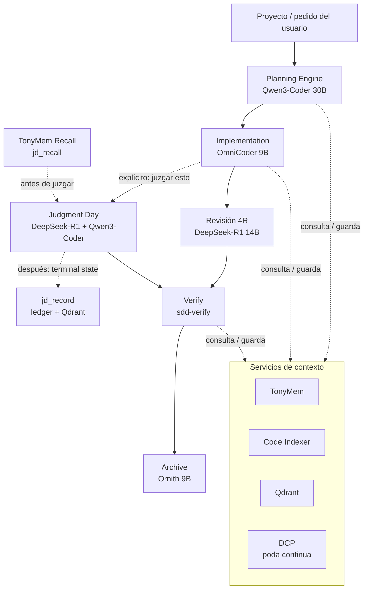

# Tony-AI

Fork de [Gentle-AI](https://github.com/gentleman-programming) — mismo SDD,
mismos comandos, mismos skills, mismo runtime. Se mantiene ~90% del proyecto
original sin tocar; el 10% que cambia son mejoras de mayor impacto,
integradas sin reinventar lo que ya funciona:

| Cambia | Reemplaza a | Estado |
|---|---|---|
| **TonyMem** | Engram | Reescrito desde cero (MCP server + plugin) |
| **Code Indexer + Qdrant** | *(no existía)* | Construido desde cero |
| **DCP** | *(no existía)* | Plugin externo integrado, no reinventado |
| **Double Review** | *(ya existía como Judgment Day)* | 2 correcciones aplicadas |
| **Model Router** | *(sin usar)* | 18 agentes ahora con modelo local asignado |
| **Judgment Day Memory Bridge** | *(no existía)* | TonyMem + Qdrant conectados a Judgment Day: recall antes de juzgar, ledger persistente después |

Todo lo demás — `commands/`, `skills/` (salvo un archivo agregado, ver abajo),
`prompts/sdd/`, la CLI, el runtime — es **byte-idéntico** a Gentle-AI. Esto
está verificado programáticamente en cada paso, no asumido.

## Cómo funciona (visión general)



Dos cosas que no son obvias mirando el diagrama:

1. **Judgment Day reemplaza a la revisión 4R, no corre en paralelo con ella.**
   Por defecto, después de Implementation corre la revisión 4R ordinaria
   (`review-risk/readability/reliability/resilience` + `review-refuter`).
   Judgment Day (dos jueces ciegos, `jd-judge-a`/`jd-judge-b`) solo se activa
   si lo pedís explícitamente — nunca los dos a la vez.
2. **TonyMem, Code Indexer/Qdrant y DCP no son un paso final.** Se consultan
   y escriben durante cada fase (contexto previo antes de arrancar, guardado
   de decisiones al terminar, poda de contexto continua). No hay una etapa
   "leer memoria" al final del pipeline.
3. **Judgment Day ahora tiene memoria propia.** Antes de lanzar a los jueces,
   se llama `jd_recall` (¿ya vimos un problema parecido?); cuando la
   lineage llega a un estado terminal, el orquestador llama `jd_record`,
   que persiste en un ledger SQLite propio (`judgment-memory/ledger.py`) y
   lo embebe/indexa en Qdrant (colección `jdmem_{project}`, separada de la
   de Code Indexer). Ver `judgment-memory/README.md`.

Ver [`ARCHITECTURE.md`](./ARCHITECTURE.md) para el detalle de cada pieza y
las decisiones detrás de cada cambio.

## Instalación

Este repo es un **overlay**: contiene solo lo que cambia sobre una
instalación existente de Gentle-AI. Ver
[`TONY-AI-INSTALL.md`](./TONY-AI-INSTALL.md) para el paso a paso exacto
(10 secciones, copy-paste, con verificación en cada una). Si corrés esto
desde NixOS, `docker/README.md` tiene las notas puntuales (Docker vs
Podman, GPU vía `nvidia-container-toolkit`) para levantar Ollama + Qdrant
en contenedor sin instalarlos nativos.

## Estructura del repo

```
tony-ai-fork/
├── README.md                          # este archivo
├── ARCHITECTURE.md                    # documentación técnica profunda
├── TONY-AI-INSTALL.md                 # instrucciones de instalación exactas
├── opencode.json                      # mcp.tonymem/code-index/judgment-memory + Model Router (diff mínimo sobre el original)
├── AGENTS.md                          # bloque TonyMem + bloque nuevo Code Indexer (diff mínimo)
├── config/
│   └── tony-memory.yaml               # referencia documentada de env vars (no se parsea, ver el archivo)
├── docker/
│   ├── docker-compose.yml             # Ollama + Qdrant (backing services, no los MCP servers)
│   ├── docker-compose.gpu.yml         # override opcional, passthrough NVIDIA
│   ├── .env.example
│   └── README.md                      # notas específicas NixOS (Docker/Podman, GPU)
├── Makefile                           # wrappers de conveniencia sobre docker/ + los tests
├── plugins/
│   ├── tonymem.ts                     # reemplaza plugins/engram.ts
│   ├── qdrant.ts                      # cliente REST Qdrant + Ollama compartido (TS)
│   └── judgment-memory.ts             # bridge: recall antes de Judgment Day, captura pasiva después
├── local-memory/                      # TonyMem — MCP server (8 tools)
│   ├── server.py
│   └── README.md
├── code-index/                        # Code Indexer + Qdrant — MCP server (3 tools)
│   ├── core.py
│   ├── server.py
│   ├── test_core.py
│   └── README.md
├── judgment-memory/                   # Judgment Day <-> TonyMem bridge — MCP server (4 tools)
│   ├── ledger.py                      # SQLite ledger + normalize + embed + Qdrant pipeline
│   ├── server.py                      # jd_recall / jd_record / jd_history / jd_stats
│   ├── schema.json                    # shape de un judgment record
│   ├── test_ledger.py                 # regression test, mock Ollama/Qdrant
│   ├── scripts/verify-qdrant.ts       # smoke test del cliente TS contra Ollama/Qdrant reales
│   └── README.md
├── commands/
│   ├── memory-search.md               # /memory-search — TonyMem + judgment-memory
│   ├── memory-stats.md                # /memory-stats
│   └── judgment-history.md            # /judgment-history — solo SQLite, sin dependencia de Qdrant
├── .opencode/
│   └── dcp.jsonc                      # config de DCP (plugin externo, no incluido acá)
└── skills/
    ├── judgment-day/SKILL.md          # +paso de recall/record (diff mínimo, ver ARCHITECTURE.md)
    └── _shared/
        └── review-ledger-contract.md  # contrato faltante que judgment-day/SKILL.md referenciaba
```

## Modelos locales (Model Router)

| Rol | Modelo | Agentes |
|---|---|---|
| Planning | `ollama/qwen3-coder:30b` | `gentle-orchestrator`, `sdd-explore`, `sdd-propose`, `sdd-design`, `sdd-spec`, `sdd-tasks`, `sdd-init`, `sdd-onboard` |
| Implementation | `ollama/omnicoder:9b` | `sdd-apply` |
| Review | `ollama/deepseek-r1:14b` | `sdd-verify`, `review-*` (5), `jd-judge-a` |
| Review (juez B) | `ollama/qwen3-coder:30b` | `jd-judge-b` — deliberadamente distinto de `jd-judge-a` |
| Execution | `ollama/ornith:9b` | `sdd-archive`, `jd-fix-agent` |

Verificá los tags reales contra `ollama list` antes de confiar en ellos —
ver `TONY-AI-INSTALL.md` sección 3b.

## Qué NO se tocó (y por qué está bien así)

`commands/*.md` (salvo los 3 nuevos de memoria, que son archivos agregados,
no modificados), la mayoría de `skills/*/SKILL.md` (`judgment-day/SKILL.md`
es la única excepción — 2 líneas de diff, ver `ARCHITECTURE.md`) y
`skills/_shared/*.md`, `prompts/sdd/*.md`, la CLI, el runtime. Los nombres
de tool (`mem_search`, `mem_save`, etc.) son idénticos a los que Engram
exponía, así que estos archivos funcionan contra TonyMem sin saber que
Engram ya no existe. Detalle completo de esta decisión en `ARCHITECTURE.md`.

## Fases pendientes

Ninguna, por ahora — los 4 componentes originalmente planeados (TonyMem,
Code Indexer + Qdrant, DCP, Double Review) más el Judgment Day Memory
Bridge agregado después están integrados. Si en algún momento se agrega
algo nuevo, va acá.
