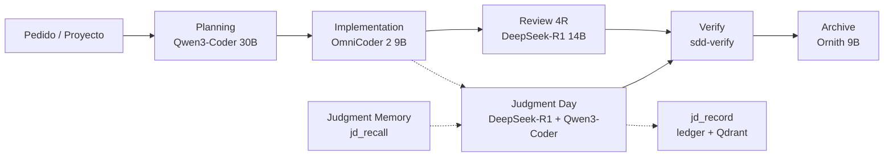
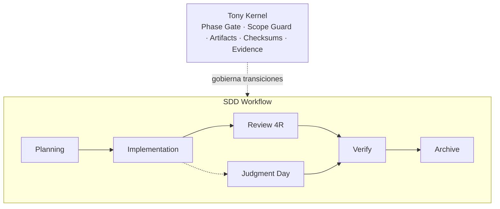

# Tony-AI
`Tony-AI` es un sistema de orquestación de agentes de IA para desarrollo de software basado en Spec-Driven Development (SDD), que utiliza múltiples LLMs locales y memoria persistente para planificar, implementar, revisar y reutilizar conocimiento operativo de los cambios realizados.  
Combina tres subsistemas principales:   

* `local-memory/` — servidor MCP de memoria persistente y duradera basada en SQLite.
* `code-index/` — indexación y búsqueda semántica del código mediante Ollama + Qdrant.
* `judgment-memory/` — almacenamiento y recuperación de decisiones, revisiones y juicios previos para reutilizar conocimiento durante futuras tareas.

La configuración de OpenCode almacena las bases SQLite persistentes de TonyMem y Judgment Memory bajo `.tonymem/`:

```text
.tonymem/memory.db
.tonymem/judgment-memory.db
```

Los servicios definidos en `docker/` proporcionan la infraestructura local para Ollama y Qdrant cuando estos servicios no están disponibles en el host.   

## ¿Cómo funciona?
`Tony-AI` orquesta el desarrollo de software mediante un flujo de trabajo basado en **Spec-Driven Development (SDD)**. El proceso separa la planificación de la implementación, la revisión, la verificación y el archivado, y utiliza agentes especializados para cada etapa.

El **FSM principal contiene exactamente ocho fases**:
**exploración → propuesta → spec → diseño → tareas → apply → verify → archive**

**Review 4R y Judgment Day son workflows auxiliares, no fases adicionales del FSM.** Pueden participar entre la implementación y la verificación sin modificar la máquina de estados.

**Tony Kernel** actúa como capa de control del flujo. Intercepta las transiciones entre fases y valida que cada etapa haya producido los artifacts y la evidencia necesarios antes de permitir avanzar.  

Entre sus controles se incluyen la validación de artifacts, verificación de checksums, scope guard y comprobaciones de evidencia.   
Si una condición obligatoria falla, la transición se bloquea y se informa el motivo exacto.

## Flujo de agentes
El trabajo comienza con el **Planning Engine**, que analiza el pedido y construye el contexto necesario para trabajar sobre el repositorio. A partir de esa planificación, el agente de **Implementation** realiza los cambios correspondientes.

Después de implementar, `Tony-AI` puede ejecutar una **Revisión 4R** para analizar los cambios y, cuando se solicita explícitamente un juicio, activar **Judgment Day**. Judgment Day recupera juicios anteriores relevantes antes de evaluar el cambio y registra el resultado una vez finalizado el juicio.

Finalmente, **Verify** ejecuta las verificaciones definidas por el flujo SDD. Cuando la implementación supera las validaciones requeridas, el proceso puede pasar a **Archive**, donde se consolida el estado final del trabajo.


## Contexto y memoria
Tony-AI separa la orquestación del workflow de los sistemas que aportan contexto y memoria.

```text
                         OpenCode
                            │
                   Tony Orchestrator
                    │       │       │
                    │       │       └── Judgment Memory
                    │       └────────── Code Index
                    └────────────────── TonyMem
                            │
                           DCP
                            │
                         SDD phase
                            │
                       Tony Kernel
```

- **TonyMem** aporta decisiones, descubrimientos y contexto persistente.
- **Code Index** aporta conocimiento semántico sobre el código.
- **Judgment Memory** aporta juicios y lecciones de revisiones anteriores.
- **DCP** administra el contexto utilizado por OpenCode.
- **Tony Kernel** no decide qué trabajo hacer: controla si una transición de fase está permitida.

La persistencia SQLite configurada para OpenCode se encuentra en `.tonymem/`; los directorios `local-memory/` y `judgment-memory/` contienen los servidores MCP que acceden a esas bases.

El objetivo no es entrenar los modelos, sino conservar, indexar y recuperar conocimiento operativo para reutilizarlo en tareas posteriores.

```text
Nueva tarea
    │
    ├── TonyMem ──────────────► decisiones y contexto previo
    ├── Code Index ───────────► código relacionado
    ├── Judgment Memory ──────► revisiones y lecciones previas
    └── DCP ──────────────────► contexto relevante
                                      │
                                      ▼
                               Agente / Orchestrator
                                      │
                                      ▼
                                 SDD Phase
                                      │
                                      ▼
                                 Tony Kernel
```

## Kernel
Si algo falla, el Kernel te dice exactamente por qué:

- **Artifacts faltantes o con hash inválido** → volvé a generar el artifact de la fase actual
- **Diff fuera de allowed_files** → revisá el scope en `openspec/change-request.md`
- **Salto de fase** → completá la fase anterior antes de avanzar

El Kernel comprueba que el cambio esté en condiciones de avanzar antes de permitir la siguiente fase.   
Entre otras cosas, controla: artifacts requeridos; checksums; alcance permitido de los cambios; evidencias; estado de la fase; transiciones válidas.   
Esto permite que el workflow no dependa únicamente de que un agente "recuerde" qué debe hacer: las condiciones críticas del proceso son verificadas por una capa de control.

## Fuentes de verdad

- `README.md` — visión general, quickstart y uso.
- `INSTALL.md` — instalación y configuración del entorno.
- `ARCHITECTURE.md` — arquitectura, responsabilidades, workflow y persistencia.
- `TESTING.md` — estrategia, comandos y cobertura de pruebas.
- `AGENTS.md` — reglas operativas para agentes y desarrollo.
- Código y tests — comportamiento implementado definitivo cuando existe una contradicción con la documentación.

Esta versión `README2.md` conserva el contenido original y solo agrega la aclaración del FSM y las fuentes de verdad para evitar divergencias entre documentos.

# Requisitos
- **Python 3.10+** — servidores MCP y tooling Python.
- **Bun** — scripts TypeScript y plugins.
- **OpenCode CLI** — orquestador SDD.
- **Ollama** — ejecución de LLM locales.
- **Docker + Docker Compose** — infraestructura de servicios, incluido Qdrant.
- **GGA (Gentleman Guardian Angel)** — code review.
- **tree-sitter** — chunking estructural del Code Indexer.
- **tree-sitter-language-pack** — grammars utilizadas por el Code Indexer.

## Modelos locales por defecto

| Función | Modelo |
|---|---|
| Planning / propuesta | `qwen3-coder:30b` |
| Implementación | `carstenuhlig/omnicoder-2-9b:q4_k_m` |
| Review / Judgment | `deepseek-r1:14b` |
| Archive / jd-fix-agent | `ornith:9b` |
| Code embeddings | `bge-m3` |
| Judgment embeddings | `nomic-embed-text` |

Los modelos se ejecutan localmente mediante Ollama.

# Instalación

```bash
git clone https://github.com/gastoncelestino/tony-ai.git
cd tony-ai
git checkout dev
./scripts/setup.sh
```

Después:

```bash
./scripts/health.sh
```

Para la instalación detallada, consultá [INSTALL.md](INSTALL.md).

# ¿Cómo se usa?

```bash
# 1. Inicializá el proyecto (una sola vez)
/sdd-init

# 2. Creá un cambio nuevo
/sdd-new "agregar rate limiting al endpoint de login"

# 3. Implementar y verificar
/sdd-apply
/sdd-verify
/sdd-archive

# 4. Consultá memoria en cualquier momento
/memory-search "rate limiting"
/memory-stats
/judgment-history
/kernel-status
```

Para retomar un cambio anterior:

```bash
/sdd-load <change-id>
/sdd-apply
/sdd-verify
/sdd-archive
```

## Comandos
| Comando | Descripción | Fuente | Offline |
|---------|-------------|--------|---------|
| `/sdd-init` | Inicializar contexto SDD | SQLite + config | ✅ |
| `/sdd-new <change>` | Nuevo cambio con SDD completo | Sub-agentes planning | ❌ |
| `/sdd-explore <task>` | Investigar una idea | Sub-agente explore | ❌ |
| `/sdd-propose` | Crear propuesta PRD | Sub-agente propose | ❌ |
| `/sdd-spec` | Especificación técnica | Sub-agente spec | ❌ |
| `/sdd-design` | Diseño técnico | Sub-agente design | ❌ |
| `/sdd-tasks` | Generar plan de tareas | Sub-agente tasks | ❌ |
| `/sdd-apply [change]` | Implementar tareas | Sub-agente writer | ❌ |
| `/sdd-verify [change]` | Validar implementación | Sub-agente verify | ❌ |
| `/sdd-archive [change]` | Cerrar cambio y archivar | SQLite/JSON | ✅ |
| `/sdd-onboard` | Walkthrough guiado de SDD | Sub-agente onboard | ❌ |
| `/sdd-status [change]` | Ver estado del cambio | Artifact store | ✅ |
| `/sdd-continue [change]` | Ejecutar siguiente fase | Sub-agentes | ❌ |
| `/sdd-ff <name>` | Fast-forward: propuesta → tareas | Sub-agentes planning | ❌ |
| `/memory-search "query"` | Búsqueda semántica en TonyMem + Judgment Memory | SQLite + Qdrant | ✅ / ❌ |
| `/memory-stats` | Estadísticas de memoria | SQLite | ✅ |
| `/judgment-history [project]` | Ver historial de juicios | SQLite ledger | ✅ |
| `juzgar esto` | Activar Judgment Day | 2 jueces + memoria | ❌ |
| `/kernel-status` | Estado del Kernel | kernel-state.json | ✅ |
| `/kernel-reset` | Resetear estado del Kernel | kernel-state.json | ✅ |

## Testing
Tony-AI separa las pruebas de código de las verificaciones que requieren infraestructura externa.
La suite local **no necesita Ollama, Qdrant ni Docker**.

```bash
python3 -m pip install -r requirements-dev.txt
make test
```

También pueden ejecutarse las suites individualmente:

```bash
make test-python
make test-ts
make test-kernel
```

Para ejecutar Python sin pytest:

```bash
python3 tools/run-python-tests.py tests
```

## Code Review automático
`GGA` valida los archivos staged contra tu `AGENTS.md` antes de cada commit, usando OpenCode como proveedor de IA.

```bash
gga install
gga config
gga run
gga run --pr-mode
gga run --no-cache
```

## Estado del proyecto
`Tony-AI` está diseñado para ejecutarse localmente, manteniendo los modelos, memoria y datos semánticos bajo control del entorno del desarrollador.

El objetivo no es solamente generar código con LLMs, sino proporcionar un workflow de desarrollo verificable, persistente y basado en especificaciones, donde los agentes pueden reutilizar el conocimiento acumulado del proyecto y donde el Kernel controla las condiciones necesarias para avanzar entre fases.

## Agradecimientos
Algunos conceptos de SDD, orquestador, prompts, skills y comandos se basan en el repositorio de github `gentle-ai` de Alan Buscaglia (`The Gentleman`), a quien agradecemos por su contenido y aportes a la comunidad.